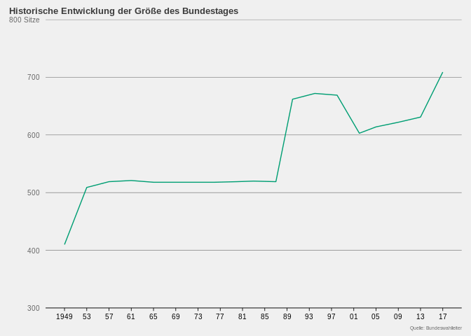

Ueberhangmandate
================

## Packages

``` r
# data manipulation
library(tidyr)
library(dplyr)
# optimization
library(lpSolveAPI)
#web scrapping
library(rvest)
#structure replacement Überhang to Ueberhang etc.
library(stringr)
# plots
library(grid)
library(ggplot2)
# packages for maps
library(rgdal)
library(rgeos)
library(mapproj)
# package for table
library(knitr)
```

## Theme

``` r
hp_theme <- function(base_size = 13, base_family = "") {
  theme_grey(base_size = base_size, base_family = base_family) %+replace%
    theme(
      
      # Base elements which are not used directly but inherited by others
      line =              element_line(colour = '#DADADA', size = 0.75,
                                       linetype = 1, lineend = "butt"),
      rect =              element_rect(fill = "#F0F0F0", colour = "#F0F0F0",
                                       size = 0.5, linetype = 1),
      text =              element_text(family = base_family, face = "plain",
                                       colour = "#656565", size = base_size,
                                       hjust = 0.5, vjust = 0.5, angle = 0,
                                       lineheight = 0.9, margin = margin(), debug = FALSE),
      plot.margin =       margin(12,10,5,10),
      # Modified inheritance structure of text element
      plot.title =        element_text(size = rel(0.75), family = '' ,
                                       face = 'bold', hjust = 0,
                                       vjust = 2.5, colour = '#3B3B3B'),
      plot.subtitle =     element_text(size = rel(0.4), family = '' ,
                                       face = 'plain', hjust = 0,
                                       vjust = 2.5, colour = '#3B3B3B', margin = margin(0,0,15,0)),
      axis.title.x =      element_blank(),
      axis.title.y =      element_blank(),
      axis.text =         element_text(),
      # Modified inheritance structure of line element
      axis.ticks =        element_line(),
      panel.grid.major =  element_line(),
      panel.grid.minor =  element_blank(),
      
      # Modified inheritance structure of rect element
      plot.background =   element_rect(),
      panel.background =  element_rect(),
      legend.key =        element_rect(colour = '#DADADA'),
      
      # Modifiying legend.position
      legend.position = 'none',
      
      complete = TRUE
    )
}
```

## Historic Size Bundestag Data Set

``` r
# read in source
  url <- 'https://www.bundeswahlleiter.de/service/glossar/u/ueberhangmandate.html'
# as the data is presented as two tables on the url we need to read them in separately
# first table [until 2009](before current election reform): no adjustments for Überhangmandate
  first_part = url %>%
    read_html() %>%
    html_node(xpath = '/html/body/div/div/main/table[1]') %>%
    html_table(fill = TRUE)
# clean up: first row contains names needed in the variable names. Then apply
# consistent and more intuitive names and keep only relevant variables 
  first_part[] <- lapply(first_part, as.character)
  names(first_part) <- paste(names(first_part), first_part[1, ], sep = "_")
  first_part <- first_part %>%
                    rename(`Jahr`=`Jahr der Bundestagswahl_Jahr der Bundestagswahl`,
                          `Wahlkreise`=`Zahl der Wahlkreise_Zahl der Wahlkreise`,
                          `Mandate`=`Sitze insgesamt 1_Sitze insgesamt 1`) %>%
                  slice(2:49) %>%
                  select(c(-5)) %>%
                  rename_all(funs(str_replace(., "Überhangmandate", "Ueberhangmandate")))

# second table [2013,2017](after current election reform): adjustments for Überhangmandate
  second_part = url %>%
    read_html() %>%
    html_node(xpath = '/html/body/div/div/main/table[2]') %>%
    html_table(fill = TRUE)
# clean up (see above)
  second_part[] <- lapply(second_part, as.character)
  names(second_part) <- paste(names(second_part), second_part[1, ], sep = "_")
  second_part <- second_part %>%
                  rename(`Jahr`=`Jahr der Bundestagswahl_Jahr der Bundestagswahl`,
                        `Wahlkreise`=`Zahl der Wahlkreise_Zahl der Wahlkreise`,
                        `Mandate`=`Sitze insgesamt_Sitze insgesamt`) %>%
                  rename_all(funs(str_replace(., "Überhänge", "Ueberhangmandate"))) %>%
                  slice(c(2:8)) %>%
                  select(c(1:6))  

# merge data frames and make everything numeric as it's needed for the graph 
  historic_size <- full_join(first_part,second_part)
  historic_size[, 1:5] <- sapply(historic_size[, 1:5], as.numeric)
  historic_size <- historic_size%>% mutate(Ueberhangmandate_Partei=replace(Ueberhangmandate_Partei, Ueberhangmandate_Partei=="–", NA)) 
# drop unnecessary data
  rm(first_part,second_part, url)
```

## Historic Size Bundestag Graph

``` r
# as the data frame contains every Ueberhangmandat per party, I only need one observation per year
  historic_size %>%
    distinct(`Jahr`, .keep_all = TRUE) %>%
    select(c(`Jahr`,`Mandate`)) %>%
    ggplot(aes(x=`Jahr`, y=`Mandate`,group=1)) +
    geom_line(aes(group=1), color="#009E73") +
    geom_hline(aes(yintercept=598)) +
    scale_y_continuous(limits = c(300, 800.1),
                       breaks = c(300,400,500,598,700,800), 
                       expand = c(0, 0),
                       labels=c("300" = "300", "400"="400", "500"="500", "598"="598 \n (heutige Normgröße)","700"= "700","800"="800 Sitze")) +
    scale_x_continuous(breaks = sort(c(seq(1960, 2010, by = 10),1949,2017)),
                       limits=c(1949,2017), 
                       labels=c("1949"="1949","1960"="60","1970"="70","1980"="80","1990"="90","2000"="2000","2010"="10", "2017"="17")) +
    labs(title = "Historische Entwicklung der Größe des Bundestages", subtitle="",caption = "Quelle: Bundeswahlleiter") +
    hp_theme() + theme(axis.text= element_text(size=7.5), axis.title.x = element_blank(),plot.title.position = "plot",  axis.title.y = element_blank(), 
                       panel.grid.major.x = element_blank(), panel.grid.major.y = element_line(size=.2, color="#656565"), axis.line.x=element_line( size=.3, color="black"),
                       legend.position = "right", legend.key = element_blank(), axis.ticks.y = element_blank(), axis.ticks.x =element_line( size=.3, color="black"),
                       plot.caption=element_text(size=5), axis.text.x=element_text(color="black"))
```

<!-- -->

,

``` r
ggsave("./HP_pic/historic_size_graph.jpg",width=4, height=3)
```

## Overview of Überhangmandaten for Parties

``` r
# rename variables for nicer table in readme
 historic_size %>%
          rename(Partei=`Ueberhangmandate_Partei`,
                `Überhangmandate_Anzahl`=`Ueberhangmandate_Anzahl`) %>%
          group_by(Partei) %>%
          filter(!is.na(Partei)) %>%
          summarise(`Überhangmandate (1949-2017)` = sum(Überhangmandate_Anzahl, rm.na=TRUE)) %>%
          kable()
```

| Partei | Überhangmandate (1949-2017) |
| :----- | --------------------------: |
| CDU    |                         112 |
| CSU    |                          11 |
| DP     |                           2 |
| SPD    |                          38 |

## 2017 Election Data Preparation

### get data

``` r
# get data
  raw <- read.csv("https://www.bundeswahlleiter.de/dam/jcr/72f186bb-aa56-47d3-b24c-6a46f5de22d0/btw17_kerg.csv", header=F, sep=";", skip=1, stringsAsFactors = F, na.strings="")
  
# keep raw data as backup
  write.csv(raw,"raw.csv", row.names = TRUE)
```

### clean up raw data

``` r
  cleaned <- raw

# For now there are not really proper column names. So I obtain party names for columns and have all names in row 6 so I can name variables in one line.
# paste party names in front of second vote ("Zweitstimme"); logic: if cell contains "Zweitstimme" grab party name from row 5, 2 cells to the left and paste it in front
# similar logic for 'Erststimme'. 
 
  for(i in 1:ncol(cleaned)){
    if(cleaned[6,i] %in% "Zweitstimmen"){
      cleaned[6,i] <- paste(cleaned[5,i-2], cleaned[6,i])
    }
    if(cleaned[6,i] %in% "Erststimmen"){
      cleaned[6,i] <- paste(cleaned[5,i], cleaned[6,i])
    }
  rm(i)}


# set new column names to names in sixth row
  colnames(cleaned) <- cleaned[6,]
# rename first to third column
  colnames(cleaned)[1:3] <- c("wahlkreisnummer","wahlkreisname", "Bundesland") 
# remove extra rows 
  cleaned <- cleaned[-(1:7),] 
# Drop numbers from previous election (no unnamed); logic: keep all columns whose name contain the letter "n"
  cleaned = cleaned[,grepl("*n",names(cleaned))]
# remove rows with missing values for 'Bundesland' (state) variable as these have NAs for all columns
  cleaned <- cleaned[!(is.na(cleaned$Bundesland)),] 
# every row expect the first two as numeric (we're counting votes, right?)
  cleaned[, 3:97] <- sapply(cleaned[, 3:97], as.numeric)

# drop aggregate values for each state as we care about counties primarily
  cleaned<-cleaned[!(cleaned$`Bundesland`==99),]

#export clean data set as backup
  write.csv(cleaned,"cleaned.csv", row.names = TRUE)
```

### double check all counties included (at the time of writing there are 299 counnties in Germany):

``` r
nrow(cleaned)
```

    ## [1] 299

## Election Map

``` r
# Get the highest number of votes for each voting district, as the party with the highest votes gets the mandate. Then rename the parties ( Ionly include the ones included in the Bundestag to save space). Add id for matching with the shape files needed for the map in the next step.
  map_actual_election <- cleaned %>% 
    select(starts_with("wahlkreis") | contains("Erststimme")) %>%
    select(-c(3:6)) %>%
    gather('Partei','Stimmen', `Christlich Demokratische Union Deutschlands Erststimmen`:`Übrige Erststimmen`) %>%
    group_by(wahlkreisnummer) %>%
    top_n(1, Stimmen) %>% 
    mutate(wahlkreisnummer=as.numeric(wahlkreisnummer)) %>%
    mutate(Partei=replace(Partei, Partei=="Christlich Demokratische Union Deutschlands Erststimmen", "CDU"),
          Partei=replace(Partei, Partei=="Sozialdemokratische Partei Deutschlands Erststimmen", "SPD"),
          Partei=replace(Partei, Partei=="DIE LINKE Erststimmen", "LINKE"),
          Partei=replace(Partei, Partei=="BÜNDNIS 90/DIE GRÜNEN Erststimmen", "GRÜNE"),
          Partei=replace(Partei, Partei=="Christlich-Soziale Union in Bayern e.V. Erststimmen", "CSU"),
          Partei=replace(Partei, Partei=="Freie Demokratische Partei Erststimmen", "FDP"),
          Partei=replace(Partei, Partei=="Alternative für Deutschland Erststimmen", "AFD"),
          Partei=replace(Partei, is.numeric(Partei), "Andere")) %>%
    select(starts_with("wahlkreis") | contains("Partei")) %>%
    mutate(id=wahlkreisnummer-1,id=as.character(id))

# check if results like actual election results:
# https://de.wikipedia.org/wiki/Bundestagswahl_2017#Endg%C3%BCltiges_Gesamtergebnis
  map_actual_election %>%
            group_by(Partei) %>%
            tally() %>%
            kable() 
```

| Partei |   n |
| :----- | --: |
| AFD    |   3 |
| CDU    | 185 |
| CSU    |  46 |
| GRÜNE  |   1 |
| LINKE  |   5 |
| SPD    |  59 |

Add shape files

``` r
# all election maps borrow heavily from https://interaktiv.morgenpost.de/analyse-bundestagswahl-2017/data/btw17_analysis.html
# load state borders and shapes of the constituencies
  shp_bund <- readOGR("btw17-shapes/bundeslaender_small.shp", "bundeslaender_small", stringsAsFactors=FALSE, encoding="latin1") %>% broom::tidy()
```

    ## OGR data source with driver: ESRI Shapefile 
    ## Source: "/home/urza/Documents/backup 10.10/Daten/V/Visualisierungen/github/Ueberhangmandate_Bundestag/btw17-shapes/bundeslaender_small.shp", layer: "bundeslaender_small"
    ## with 16 features
    ## It has 4 fields
    ## Integer64 fields read as strings:  WKR_NR

``` r
  shp_wahlkreise <- readOGR("btw17-shapes/wahlkreise_small.shp", "wahlkreise_small", stringsAsFactors=FALSE, encoding="latin1") 
```

    ## OGR data source with driver: ESRI Shapefile 
    ## Source: "/home/urza/Documents/backup 10.10/Daten/V/Visualisierungen/github/Ueberhangmandate_Bundestag/btw17-shapes/wahlkreise_small.shp", layer: "wahlkreise_small"
    ## with 299 features
    ## It has 4 fields
    ## Integer64 fields read as strings:  WKR_NR

``` r
  shp_wahlkreise <- shp_wahlkreise %>% broom::tidy() # broom to tidy shape data to make it work smoothly with the graphic package ggplot2
                                                 
  map_actual_election <- merge(shp_wahlkreise, map_actual_election, by="id", all.y=T) # merge shapes with vote data by id
```

## Election Map 2017

``` r
# actual graph
  ggplot(data=map_actual_election, aes(x=long, y=lat, group=group))+
    geom_polygon(aes(fill=Partei), show.legend = T) +
    geom_polygon(data=shp_wahlkreise, aes(x=long, y=lat, group=group), fill=NA, color="white", size=0.4) +
    scale_fill_manual(values=c("royalblue1", "#32302e", "blue4", "#46962b", "magenta1", "#E3000F")) +
    labs(title = "Bundestagswahl 2017", subtitle="",caption = "Quelle: Bundeswahlleiter") +
    coord_map() + # apply projection
    theme_void() +  # remove axes
    theme()
```

<!-- -->

# State Data Frames

Replace state numbers with names create a data set for each state
(Land=number to differentiate between states). Also only keep the
parties in the parliament

``` r
# Vector for the number of seats allocated for each state. The reason for doing this by hand
# stems from the fact that it has already been calculated by the Bundeswahlleiter in the past. Moreover, the formal rule of
# 2 * counties = seats does not always apply due to rounding. 
# source: https://www.bundeswahlleiter.de/dam/jcr/dd81856b-7711-4d9f-98dd-91631ddbc37f/btw17_sitzberechnung.pdf
# The order of seats follows the order of states in the following steps.
  seats <- c(22,12,59,5,128,43,30,76,93,7,24,20,13,32,17,17)
```

### split data frame into data frames for each state. We need this as later on each state is it’s own maxmization problem

``` r
# Additionally replace numbers with names for states for easier understanding. 
# 'state' vector for state names; 'data_state' vector needed for the names of the individual state data frames.
# Additionally a clean data frame for each state as a potential backup source. 
  state <- c("SCH","HAM","NDS","BRE","NRW","HES","RHN","BAD","BAY","SAR","BER","BRA","MEC","SAC","SAA","THU")
  data_state <- paste( "state_",state, sep="")
# create data frames
  for (i in 1:16) {
    cleaned <- cleaned %>% mutate(Bundesland=replace(Bundesland, Bundesland==i, state[i]))
    assign(paste0(data_state[i]), cleaned[cleaned$Bundesland==state[i],])
  rm(i)}

# remove not needed list (short names states)
  rm(state)
```

### create dynamic state datasets

this is needed for the calculation of the amount of ‘Überhangmandaten’
and seats per party from a given state

``` r
dynamic_state <- paste(data_state, "_dynamic", sep="")
for (i in 1:16) {
# create loop dummy datasets so coding gets easier
  loop <-  data.frame(partei =c("CDU","SPD","LINKE","GRÜNE","CSU","FDP","AFD"),
                     stringsAsFactors = FALSE)
# Sitzkontingent state
  loop$Sitzkontingent <- seats[i]
# select state data frame
  loop_state <- get(data_state[i])
# sum Zweitstimmen (second vote)
  loop <- loop %>% mutate(sum_zweitstimmen=sum(loop_state$`Gültige Zweitstimmen`))
# divisor: votes per seat
  loop <- loop %>% mutate(divisor=sum_zweitstimmen/Sitzkontingent)
# Zweitstimmen (second vote) per party
  loop$zweitstimmen <- 0
  loop <- loop %>% mutate(zweitstimmen=replace(zweitstimmen, partei=="CDU", sum(loop_state$`Christlich Demokratische Union Deutschlands Zweitstimmen`, na.rm = TRUE)),
                          zweitstimmen=replace(zweitstimmen, partei=="SPD", sum(loop_state$`Sozialdemokratische Partei Deutschlands Zweitstimmen`, na.rm = TRUE)),         
                          zweitstimmen=replace(zweitstimmen, partei=="LINKE", sum(loop_state$`DIE LINKE Zweitstimmen`, na.rm = TRUE)),                                   
                          zweitstimmen=replace(zweitstimmen, partei=="GRÜNE", sum(loop_state$`BÜNDNIS 90/DIE GRÜNEN Zweitstimmen`, na.rm = TRUE)),                         
                          zweitstimmen=replace(zweitstimmen, partei=="CSU", sum(loop_state$`Christlich-Soziale Union in Bayern e.V. Zweitstimmen`, na.rm = TRUE)),        
                          zweitstimmen=replace(zweitstimmen, partei=="FDP", sum(loop_state$`Freie Demokratische Partei Zweitstimmen`, na.rm = TRUE)),                     
                          zweitstimmen=replace(zweitstimmen, partei=="AFD", sum(loop_state$`Alternative für Deutschland Zweitstimmen`, na.rm = TRUE)))
# save to data frame  
  assign(paste0(dynamic_state[i]), loop,)
# remove not needed values
  rm(loop,loop_state,i)
  }
```

### Get right mandate allocation per party per state for 2017 election.

Note: for the method described by law you would only add or subtract 1
(instead of 10). However, this will make the code run significantly
slower. If you have time to spare, feel free to modify the code.

``` r
# seats per party
# create vector so you can test later on if seats allocated is how the Bundeswahlleiter determined it to be
  test <- c()
  for (i in 1:16) {
# create loop dummy datasets so coding gets easier
  loop_state <- get(dynamic_state[i])
# votes to mandates per party
  loop_state <- loop_state %>% mutate(mandate=round(zweitstimmen/divisor))
# sum mandates
  number <- sum(loop_state$mandate)
# get mandates allocated to state
  allocated_seats <- seats[i]

# too few allocated seats: solution decrease divisor for convergence from votes to seats
  while (allocated_seats > number){
    loop_state$divisor <- loop_state$divisor-10
    loop_state <- loop_state %>% mutate(mandate=round(zweitstimmen/divisor))
    number <- sum(loop_state$mandate)
  }
# too many allocated seats: solution increase divisor for convergence from votes to seats
  while (number > allocated_seats){
    loop_state$divisor <- loop_state$divisor+10
    loop_state <- loop_state %>% mutate(mandate=round(zweitstimmen/divisor))
    number <- sum(loop_state$mandate)
  }
# add number for checking
  test[i] <- sum(loop_state$mandate)

# save to data frame  
  assign(paste0(dynamic_state[i]), loop_state,)
# clean up  
  rm(loop_state,number,allocated_seats,i)
  
  }
```

### check and clean up

``` r
# check whether amount of seats as calculated by Bundeswahlleiter matches
# with my values per state
  all.equal(seats, test)
```

    ## [1] TRUE

``` r
# check if seats assigned to party in state NRW (most populous) equal:
# source: https://www.bundeswahlleiter.de/dam/jcr/dd81856b-7711-4d9f-98dd-91631ddbc37f/btw17_sitzberechnung.pdf
# (p.6)  
  nrw <- data.frame(partei=c("CDU","SPD","LINKE","GRÜNE","CSU","FDP","AFD"),
                      mandate=c(43,35,10,10,0,17,13))

 state_NRW_dynamic %>% 
                  select(1,6) %>%
                        all.equal(nrw)
```

    ## [1] TRUE

``` r
# clean up
  rm(nrw,test)                 
```

``` r
# double check: whether mandates by party add up to numbers from Bundeswahlleiter:
# get all mandates per party from each state
  test2 <- state_SCH_dynamic %>% select(partei,mandate)
  for (i in 2:16) {
    loop_state <- get(dynamic_state[i])
    loop_state <- loop_state %>% select(partei,mandate)
    test2 <- rbind(test2,loop_state)
  }
  # get sum and see if they add up to 598
  sum(test2$mandate)
```

    ## [1] 598

``` r
  # get sum of mandates for each party (this should equal final distribution)
  test2 %>% 
    group_by(partei) %>% 
    summarise(mandate = sum(mandate)) %>%
    kable() 
```

| partei | mandate |
| :----- | ------: |
| AFD    |      83 |
| CDU    |     164 |
| CSU    |      39 |
| FDP    |      65 |
| GRÜNE  |      57 |
| LINKE  |      59 |
| SPD    |     131 |

``` r
# cleanup
  rm(test2)
```

# Optimal Allocation preparation

``` r
checkup_nrw <- state_NRW[,!grepl("Zweitstimme",names(state_NRW))]
checkup_nrw <- checkup_nrw %>% 
                  select(c(1:3,8:14))

for (i in 1:16) {

# change loop data set for easy coding  
  loop_state <- get(data_state[i])

# drop all variables for 'Zweitstimme' (second vote), as we are only concerned with 'Erststimme' (first/direct vote) 
# from now on so it will be easier to follow this way.
# (we have the sum of second votes saved in the "state_XXX" data frames and the clean_XXX data frames for backup to be able to double check)
  loop_state <- loop_state[,!grepl("Zweitstimme",names(loop_state))]
  
# only keep parties represented in the parliament as only mandates for these parties will decrease the overall size
# Additionally, rename them for easier readability. 
  loop_state <-  loop_state %>% 
                  select(c(1:3,8:14)) %>% 
                  rename(  CDU = `Christlich Demokratische Union Deutschlands Erststimmen`,
                           SPD = `Sozialdemokratische Partei Deutschlands Erststimmen`,
                           LINKE = `DIE LINKE Erststimmen`,
                           GRÜNE = `BÜNDNIS 90/DIE GRÜNEN Erststimmen`,
                           CSU = `Christlich-Soziale Union in Bayern e.V. Erststimmen`,
                           FDP = `Freie Demokratische Partei Erststimmen`,
                           AFD = `Alternative für Deutschland Erststimmen`)

# get highest amount of 'Erststimmen' for each 'Wahlkreis': note -1 for parties which had no candidate.
# A negative number is required here as later on when calculating the votes needed, negative numbers
# result in higher numbers, which means they're not selected. (see. next step)
  loop_state[is.na(loop_state)] <- -1

# get highest number of votes for each 'Wahlkreis' so we can calculate differences   
   loop_state$max <- apply(loop_state[, 4:10], 1, max)

# get difference from max of votes for each 'Wahlkreis' per party:
# we need this so we can apply the minimization optimization in the next step.
        for (x in 1:nrow(loop_state)){
        max <- loop_state[x,11]
        for (y in 4:10){
        loop_state[x,y] <- max-loop_state[x,y]
        }
        }
   
# for graph: get margin from highest to second highest
  loop_state$second_party <- apply(loop_state[, 4:10], 1, function(x) names(sort(x)[2]))
 

   
  
# sort by 'wahlkreisnummer' - so you can match by row number later on
# as matrix from minimization has no 'wahlkreisnummer' but it sorted by rows in this data frame.
# Also drop max of votes received as no longer needed.
  loop_state <- loop_state %>% 
                    mutate(wahlkreisnummer=as.numeric(wahlkreisnummer)) %>% 
                    arrange(wahlkreisnummer) %>%
                    mutate(matching=1:nrow(loop_state)) %>% 
                    select(-c(max))
   

  
# save to data frame  
  assign(paste0(data_state[i]), loop_state,)

# cleanup
  rm(loop_state,i,x,y,max)    

}
```

# Actual Optimization

Note: we have two constraints: 1. The amount of mandates in total
awarded two a party should not exceed the amount of mandates a party is
entitled to according to the Zweitstimmen (second votes). 2. Each county
(wahlkreis) should only have one direct candidate.

``` r
for (i in 1:16) {
# create loop dummy datasets so coding gets easier
loop_state <- get(dynamic_state[i])

# 1. constrain: Zweitstimmenmandate
  max_seats <- loop_state$mandate 

# keep only variables needed for calculation (difference from maximum votes per party)
# as this is the only thing that matters for the calculation. 
  loop_state <- get(data_state[i])
  calculation <- loop_state %>% 
                              select(4:10) %>% 
                              as.matrix()


# the follow steps borrow heavily from: https://stackoverflow.com/questions/31813686/lpsolve-in-r-with-character-and-column-sum-contraints  
  
# obtain dimensions matrix
  n_wahlkreise <- nrow(calculation)
  n_parteien <- ncol(calculation)
  ncol = n_wahlkreise*n_parteien 
  
  lp_matching <- make.lp(ncol=ncol)
  
# we want integer assignments and minimize the votes changed for the optimal solution with no Überhangmandaten
  set.type(lp_matching, columns=1:ncol, type = c("integer"))
  set.objfn(lp_matching, calculation)
  lp.control(lp_matching,sense='min')
 
# 2. constrain: one mandate per county 'wahlkreisen'
  
# solution vector which contains 1s with length equal to number of 'wahlkreisen'
  max_pro_wahlkreis <- replicate(n_wahlkreise, 1)   
  
  Add_Max_wahlkreis_constraint <- function (wahlkreis_index) {
    wahlkreis_cols <- (0:(n_parteien-1))*n_wahlkreise + wahlkreis_index
    add.constraint(lp_matching, rep(1,n_parteien), indices=wahlkreis_cols,type = c("="), rhs=1)
  }
  
# Add a max_number constraint for each wahlkreis
  lapply(1:n_wahlkreise, Add_Max_wahlkreis_constraint)
  
# Add max values for each party (first constraint)
  mandate.value <- rep(1, n_wahlkreise) # Add that each mandate is worth on mandate  
  
  Add_max_sitze_constraint <- function (partei_index) {
    partei_cols <- (partei_index-1)*n_wahlkreise + (1:n_wahlkreise) 
    add.constraint(lp_matching, xt=mandate.value, indices=partei_cols, rhs=max_seats[partei_index])
  }
  
# Add a max_number constraint for each party
  lapply(1:n_parteien, Add_max_sitze_constraint)
  
# Actual calculation and obtain dummies indicating, which party a 'wahlkreis' goes to
  solve(lp_matching)
  get.variables(lp_matching)  
  
# 11. create dataset (ncol=7  as seven parties in parliament)
  calculation <- get.variables(lp_matching) %>% 
                  matrix(ncol=7)  %>%
                  as.data.frame() %>%
                    rename(CDU_county = 1,
                          SPD_county = 2,
                          LINKE_county = 3,
                          GRÜNE_county = 4,
                          CSU_county = 5,
                          FDP_county = 6,
                          AFD_county = 7)
# 12. variable for matching
  calculation$matching <- 1:nrow(calculation)
  
# 13 .matching
  calculation <- merge(loop_state,calculation,by="matching")  
 
# save to data frame  
  assign(paste0(data_state[i]), calculation,)  
  
# clean up
rm(i,lp_matching,mandate.value,max_pro_wahlkreis,max_seats,n_parteien,n_wahlkreise,ncol,Add_max_sitze_constraint,Add_Max_wahlkreis_constraint,calculation,loop_state)
}
```

\#————————————-

# Creating Variables

``` r
margins <- data.frame(wahlkreisnummer=numeric(), margin=numeric())
mandate <- data.frame(wahlkreisnummer=numeric(), wahlkreisname=numeric(),Bundesland=character(), mandate_actual=character(), mandate_optimisation=character(), votes_needed=numeric(),votes_halved=numeric())


for (i in 1:16) {
 
    clean_up <- get(data_state[i])
# variable indicating winner when optimised
    clean_up <- clean_up %>%
                  mutate(mandate_optimisation="CDU") %>%
                  mutate(mandate_optimisation=replace(mandate_optimisation, SPD_county == 1, "SPD"),
                        mandate_optimisation=replace(mandate_optimisation, LINKE_county == 1, "LINKE"), 
                        mandate_optimisation=replace(mandate_optimisation, GRÜNE_county == 1, "GRÜNE"),
                        mandate_optimisation=replace(mandate_optimisation, CSU_county == 1, "CSU"),
                        mandate_optimisation=replace(mandate_optimisation, FDP_county == 1, "FPD"),
                        mandate_optimisation=replace(mandate_optimisation, AFD_county == 1, "AFD"))
    
    
# get actual direct Mandate Party name for each Wahlkreis (logic: normal winner = 0)
  
  clean_up <- clean_up %>%
                mutate(mandate_actual="CDU") %>%
                mutate(mandate_actual=replace(mandate_actual, SPD==0, "SPD"),
                      mandate_actual=replace(mandate_actual, LINKE==0, "LINKE"),
                      mandate_actual=replace(mandate_actual, GRÜNE==0, "GRÜNE"),
                      mandate_actual=replace(mandate_actual, CSU==0, "CSU"),
                      mandate_actual=replace(mandate_actual, FDP==0, "FDP"),
                      mandate_actual=replace(mandate_actual, AFD==0, "AFD"))
          
  
# voter change needed for optimization  
  clean_up <- clean_up %>%
                 mutate(votes_needed=0) %>%
                 mutate(votes_needed=replace(votes_needed, CDU_county == 1, CDU[CDU_county == 1]),
                         votes_needed=replace(votes_needed, SPD_county == 1, SPD[SPD_county == 1]),
                         votes_needed=replace(votes_needed, LINKE_county == 1, LINKE[LINKE_county == 1]),
                         votes_needed=replace(votes_needed, GRÜNE_county == 1, GRÜNE[GRÜNE_county == 1]),
                         votes_needed=replace(votes_needed, CSU_county == 1, CSU[CSU_county == 1]),
                         votes_needed=replace(votes_needed, AFD_county == 1, AFD[AFD_county == 1]),
                         votes_needed=replace(votes_needed, FDP_county == 1, FDP[FDP_county == 1]))  %>%
                    as.data.frame()

#  divide by two as half amount would already amount to flip county
  clean_up <- clean_up %>% mutate(votes_halved= ceiling(votes_needed/2))
  
# margins between first and second as data frame for graph (not optimized!!!)  
  clean_up <- clean_up  %>%
                    mutate(margin=0) %>%
                    mutate(margin=replace(margin,  second_party == "CDU", CDU[second_party == "CDU"]),
                          margin=replace(margin, second_party == "SPD", SPD[second_party == "SPD"]),
                          margin=replace(margin, second_party == "LINKE", LINKE[second_party == "LINKE"]),
                          margin=replace(margin, second_party == "GRÜNE", GRÜNE[second_party == "GRÜNE"]),
                          margin=replace(margin, second_party == "CSU", CSU[second_party == "CSU"]),
                          margin=replace(margin, second_party == "AFD", AFD[second_party == "AFD"]),
                          margin=replace(margin, second_party == "FDP", FDP[second_party == "FDP"])) %>%
                    as.data.frame()

  margins_placeholder <- clean_up %>% select(wahlkreisnummer,margin)
  margins <- rbind(margins,margins_placeholder)
    


# only keep variables needed
  clean_up <- clean_up %>% select(-c(1,5:19,24)) %>% relocate(any_of(c("wahlkreisnummer" ,"wahlkreisname","Bundesland", "mandate_actual", "mandate_optimisation", "votes_needed","votes_halved")))

  
  
# merge with data frame for analysis
  mandate <- rbind(mandate,clean_up)
# cleanup
  rm(loop_state,i,margins_placeholder,clean_up)
}
```

# check ups

``` r
mandate %>% 
    group_by(mandate_actual) %>%
    tally() %>%
    kable() 
```

| mandate\_actual |   n |
| :-------------- | --: |
| AFD             |   3 |
| CDU             | 185 |
| CSU             |  46 |
| GRÜNE           |   1 |
| LINKE           |   5 |
| SPD             |  59 |

``` r
mandate %>% 
    group_by(mandate_optimisation) %>%
    tally() %>%
    kable() 
```

| mandate\_optimisation |   n |
| :-------------------- | --: |
| AFD                   |  14 |
| CDU                   | 152 |
| CSU                   |  39 |
| GRÜNE                 |   3 |
| LINKE                 |   6 |
| SPD                   |  85 |

``` r
mandate %>% 
    filter(mandate_actual!=mandate_optimisation) %>%
    group_by(mandate_actual,mandate_optimisation) %>%
    tally() %>%
    kable() 
```

| mandate\_actual | mandate\_optimisation |  n |
| :-------------- | :-------------------- | -: |
| CDU             | AFD                   | 11 |
| CDU             | GRÜNE                 |  2 |
| CDU             | LINKE                 |  1 |
| CDU             | SPD                   | 22 |
| CSU             | SPD                   |  7 |
| SPD             | CDU                   |  3 |

# Drop not needed data frames and values:

``` r
# drop data frames
rm(list=c(data_state,dynamic_state))
# drop values
rm(data_state,dynamic_state,seats)
```

# Margins Graph - CHANGE LIMIT X AXIS?

``` r
margins %>% 
  filter(margin!=0) %>%
  arrange(desc(margin)) %>%
  mutate(number=1:n()/299)%>%
    ggplot(aes(y=number,x=margin)) +
      geom_smooth(span = 0.1,color="#009E73") +
      scale_y_continuous(limits = c(0, 1.01),
                       breaks = c(seq(0.25,1,0.25)),
                       expand = c(0, 0), 
                       labels=c("0.25" = "25", "0.5"="50", "0.75"="75", "1"="100 %\n der Wahlkreise")) +
      scale_x_continuous(breaks =c(0,20000,40000,60000),
                         labels=c("0"="0","20000"="20000", "40000"="40000", "60000"="60000"),
                         limits=c(0,70000),
                         expand = c(0, 0)) +
      labs(title = "Kummulierte Anzahl an Wahlkreise nach Abstand Erst- und Zweitstimme", subtitle="X Prozent der Wahlkreis Abstand X oder kleiner",caption = "Quelle: Bundeswahlleiter") +
      hp_theme() + theme(axis.text= element_text(size=7.5), axis.title.x = element_blank(),plot.title.position = "plot",  axis.title.y = element_blank(), 
                       panel.grid.major.x = element_blank(), panel.grid.major.y = element_line(size=.2, color="#656565"), axis.line.x=element_line( size=.3, color="black"),
                       legend.position = "right", legend.key = element_blank(), axis.ticks.y = element_blank(), axis.ticks.x =element_line( size=.3, color="black"),
                       plot.caption=element_text(size=5), axis.text.x=element_text(color="black"))
```

<!-- -->

# Optimizied Election Map

``` r
map_optimized_election <- mandate %>%
          mutate(change=NA) %>%
          mutate(change=replace(change,mandate_actual!=mandate_optimisation,mandate_optimisation)) %>%
          mutate(id=wahlkreisnummer-1,id=as.character(id)) 
          
map_optimized_election<- merge(shp_wahlkreise, map_optimized_election, by="id", all.y=T)


  ggplot(data=map_optimized_election, aes(x=long, y=lat, group=group))+
    geom_polygon(aes(fill=change), show.legend = T) +
    geom_polygon(data=shp_wahlkreise, aes(x=long, y=lat, group=group), fill=NA, color="black", size=0.4) +
    scale_fill_manual(values=c("#32302e","#E3000F","white")) +
    labs(title = "Änderungen nach Optimisierung", subtitle="",caption = "Quelle: Bundeswahlleiter") +
    coord_map() + # apply projection
    theme_void() +  # remove axes
    theme()
```

<!-- -->

# Ueberhang Data Frame

``` r
ueberhang <- mandate %>% 
    filter(mandate_actual!=mandate_optimisation) %>%
    arrange(votes_needed)
```
