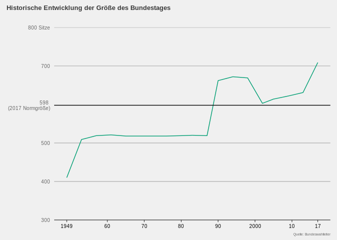
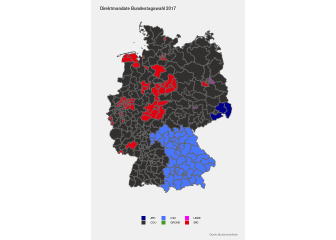
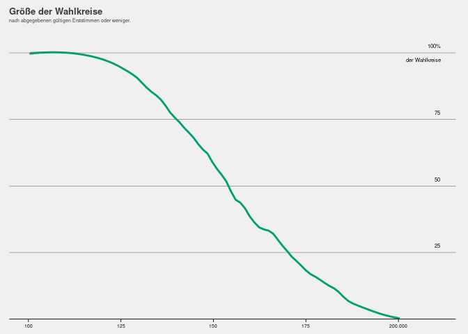
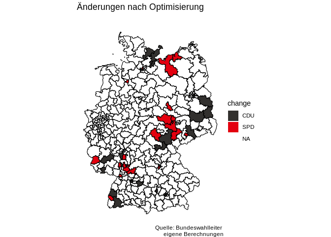
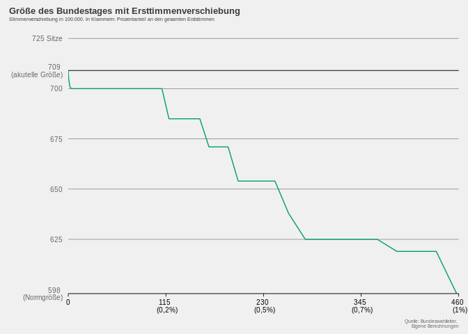
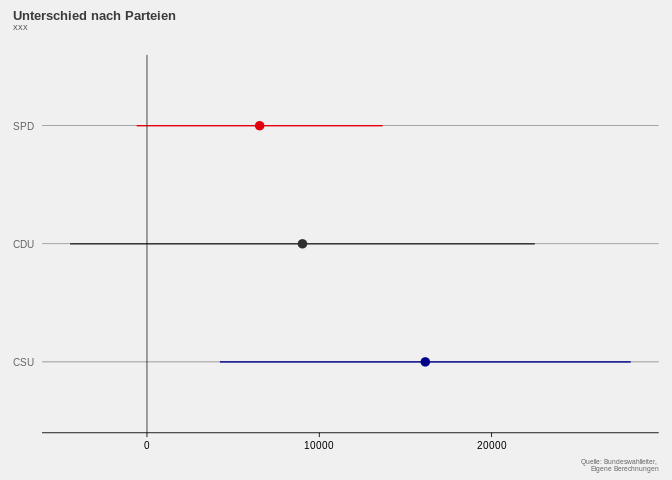
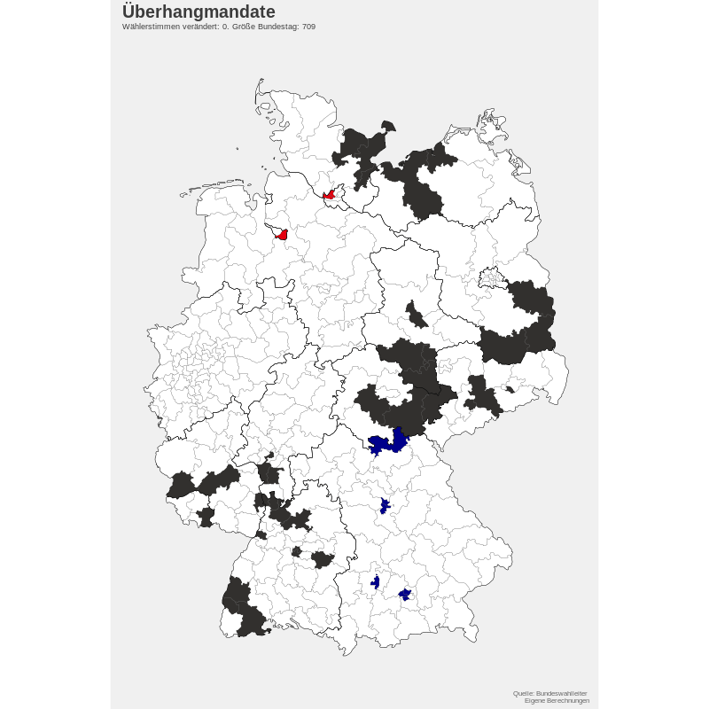

Ueberhangmandate
================

## Packages

``` r
# data manipulation
library(tidyverse)
library(dplyr)
# optimization
library(lpSolveAPI)
#web scrapping
library(rvest)
#structure replacement Überhang to Ueberhang etc.
library(stringr)
# plots
library(grid)
library(ggplot2)
# packages for maps
library(rgdal)
library(rgeos)
library(mapproj)
# package for table
library(knitr)
# for gif
library(gganimate)
library(transformr)
```

## Theme

``` r
hp_theme <- function(base_size = 13, base_family = "") {
  theme_grey(base_size = base_size, base_family = base_family) %+replace%
    theme(
      
      # Base elements which are not used directly but inherited by others
      line =              element_line(colour = '#DADADA', size = 0.75,
                                       linetype = 1, lineend = "butt"),
      rect =              element_rect(fill = "#F0F0F0", colour = "#F0F0F0",
                                       size = 0.5, linetype = 1),
      text =              element_text(family = base_family, face = "plain",
                                       colour = "#656565", size = base_size,
                                       hjust = 0.5, vjust = 0.5, angle = 0,
                                       lineheight = 0.9, margin = margin(),
                                       debug = FALSE),
      plot.margin =       margin(12,10,5,10),
      # Modified inheritance structure of text element
      plot.title =        element_text(size = rel(0.75), family = '' ,
                                       face = 'bold', hjust = 0,
                                       vjust = 2.5, colour = '#3B3B3B'),
      plot.subtitle =     element_text(size = rel(0.4), family = '' ,
                                       face = 'plain', hjust = 0,
                                       vjust = 2.5, colour = '#3B3B3B', 
                                       margin = margin(0,0,15,0)),
      axis.title.x =      element_blank(),
      axis.title.y =      element_blank(),
      axis.text =         element_text(),
      # Modified inheritance structure of line element
      axis.ticks =        element_line(),
      panel.grid.major =  element_line(),
      panel.grid.minor =  element_blank(),
      
      # Modified inheritance structure of rect element
      plot.background =   element_rect(),
      panel.background =  element_rect(),
      legend.key =        element_rect(colour = '#DADADA'),
      
      # Modifiying legend.position
      legend.position = 'none',
      
      complete = TRUE
    )
}
```

## Historic Size Bundestag Data Set

``` r
# read in from source
url <- 'https://www.bundeswahlleiter.de/service/glossar/u/ueberhangmandate.html'

# as the data is presented in two tables on the web page, we need to read them
# in separately. First table [until 2009](before current election reform):
# no adjustments for Überhangmandate
  table = url %>%
    read_html() %>%
    html_node(xpath = '/html/body/div/div/main/table[1]') %>%
    html_table(fill = TRUE)
# clean up: 
# First, the first row contains names needed in the variable names. 
  table[] <- lapply(table, as.character)
  names(table) <- paste(names(table), table[1, ], sep = "_")
# Second, apply consistent and more intuitive names 
# and keep only relevant variables   
  Historic_Parliament_Size <- table %>%
                rename(`Jahr`=`Jahr der Bundestagswahl_Jahr der Bundestagswahl`,
                          `Wahlkreise`=`Zahl der Wahlkreise_Zahl der Wahlkreise`,
                          `Mandates`=`Sitze insgesamt 1_Sitze insgesamt 1`) %>%
                slice(2:49) %>%
                select(c(-5)) %>%
                rename_all(funs(str_replace(., "Überhangmandate", 
                                            "Ueberhangmandate")))

# Second table [2013,2017](after current election reform): 
# adjustments for Überhangmandate
  table = url %>%
    read_html() %>%
    html_node(xpath = '/html/body/div/div/main/table[2]') %>%
    html_table(fill = TRUE)
# clean up (see above) and merge with first data frame
  table[] <- lapply(table, as.character)
  names(table) <- paste(names(table), table[1, ], sep = "_")
table <-  table %>%
          rename(`Jahr`=`Jahr der Bundestagswahl_Jahr der Bundestagswahl`,
                    `Wahlkreise`=`Zahl der Wahlkreise_Zahl der Wahlkreise`,
                    `Mandates`=`Sitze insgesamt_Sitze insgesamt`) %>%
          rename_all(funs(str_replace(., "Überhänge", "Ueberhangmandate")))  %>%
          slice(-c(1)) %>%
          slice(c(1:7)) %>%
          select(c(1:6))  

# merge tables  
Historic_Parliament_Size <- full_join(Historic_Parliament_Size,table)
  
# drop data frames and url, which are not needed anymore  
  rm(table, url)  
    

# merge data frames and make everything numeric as it's needed for the graph 
  Historic_Parliament_Size[, 1:5] <- sapply(Historic_Parliament_Size[, 1:5], as.numeric)
# replace "-" for zero Ueberhangmandate for a party in a given year with NA  
  Historic_Parliament_Size <- Historic_Parliament_Size%>% mutate(Ueberhangmandate_Partei=replace(
                                            Ueberhangmandate_Partei,
                                            Ueberhangmandate_Partei=="–", NA)) 
```

## Historic Size Bundestag Graph

``` r
# as the data frame contains every Ueberhangmandat per party, 
# I only need one observation per year. However, the remaining years also need
# to have numbers to achieve abrupt changes in the graph. Hence, the fill
# commands.

graph_historic_size <- data.frame("Jahr"=1949:2020, stringsAsFactors = FALSE)

graph_historic_size <- Historic_Parliament_Size %>%
  distinct(`Jahr`, .keep_all = TRUE) %>%
  select(c(`Jahr`,`Mandates`)) %>%
  left_join(graph_historic_size,.) %>%
  fill(`Mandates`)
  
graph_historic_size %>%
  ggplot(aes(x=`Jahr`, y=`Mandates`,group=1)) +
  geom_line(aes(group=1), color="#009E73") +
  geom_hline(aes(yintercept=598)) +
  scale_y_continuous(position = "right",
                    limits = c(300, 800.1),
                    breaks = c(300,400,500,598,700,800), 
                    expand = c(0, 0),
                    labels=c("300" = "", "400"="400", "500"="500", 
                                "598"="598 \n (2017 Normgröße)","700"= "700",
                                "800"="800 Sitze")) +
    scale_x_continuous(breaks = sort(c(seq(1960, 2020, by = 10),1949)),
                       limits=c(1949,2020.1), 
                       labels=c("1949"="1949","1960"="60","1970"="70",
                                "1980"="80","1990"="90","2000"="2000",
                                "2010"="10", "2020"="20"),
                        expand = c(0, 0)) +
    labs(title = "Historische Entwicklung der Größe des Bundestages", 
         subtitle="",caption = "Quelle: Bundeswahlleiter") +
    hp_theme() + 
    theme(axis.text= element_text(size= 7.5), 
          axis.title.x = element_blank(), 
          plot.title.position = "plot",  
          axis.title.y = element_blank(), 
          panel.grid.major.x = element_blank(), 
          panel.grid.major.y = element_line(size= .2, color="#656565"), 
          axis.line.x= element_line(size= .3, color="black"),
          legend.position = "right", legend.key = element_blank(), 
          axis.ticks.y = element_blank(), 
          axis.ticks.x = element_line( size=.3, color="black"),
          plot.caption= element_text(size=5,hjust = 1.2), 
          axis.text.x= element_text(color="black"))
```

<!-- -->

``` r
ggsave("./HP_pic/Historic_Parliament_Size_graph.jpg",width=4, height=3)
```

## Overview of Überhangmandaten for Parties

``` r
# rename variables for nicer table in readme
 Historic_Parliament_Size %>%
          rename(Partei=`Ueberhangmandate_Partei`) %>%
          group_by(Partei) %>%
          filter(!is.na(Partei)) %>%
          summarise(`Überhangmandate (1949-2017)` = sum(Ueberhangmandate_Anzahl, 
                                                         rm.na=TRUE)) %>%
          kable()
```

| Partei | Überhangmandate (1949-2017) |
| :----- | --------------------------: |
| CDU    |                         112 |
| CSU    |                          11 |
| DP     |                           2 |
| SPD    |                          38 |

## 2017 Election Data Preparation

### get data

``` r
# get data from the Bundeswahlleiter (Federal Returning Officer)

  raw <- read.csv("https://www.bundeswahlleiter.de/dam/jcr/72f186bb-aa56-47d3-b24c-6a46f5de22d0/btw17_kerg.csv", 
                  header=F, 
                  sep=";", 
                  skip=1, 
                  stringsAsFactors = F, 
                  na.strings="")
  
# keep raw data as backup
  write.csv(raw,"raw.csv", row.names = TRUE)
```

### clean up raw data

``` r
# For now the data frame has no proper column names. Hence, I obtain party names
# and have all names in row 6 so I can name variables in one line. Idea:
# paste party names in front of second vote ("Zweitstimme"); 
# Logic: if cell contains "Zweitstimme" grab the party name from row 5 and then
# 2 cells to the left of the cell and paste content it in front.
# Similar logic for 'Erststimme'. 
   cleaned <- raw

  for(i in 1:ncol(cleaned)){
    if(cleaned[6,i] %in% "Zweitstimmen"){
      cleaned[6,i] <- paste(cleaned[5,i-2], cleaned[6,i])
    }
    if(cleaned[6,i] %in% "Erststimmen"){
      cleaned[6,i] <- paste(cleaned[5,i], cleaned[6,i])
    }
  rm(i)}

# set new column names to names in sixth row
  colnames(cleaned) <- cleaned[6, ]
  
# additional clean up: 
# rename first to third column manually for more intuitive names
  colnames(cleaned)[1:3] <- c("Wahlkreisnummer", "Wahlkreisname", "Bundesland")
  
# remove extra rows 
  cleaned <- cleaned[-(1:7), ]
  
# Drop numbers from previous election (unnamed columns); 
# logic: keep all columns whose name contain the letter "n"
  cleaned = cleaned[ , grepl("*n", names(cleaned))]
  
# remove rows with missing values for 'Bundesland' (state) variable,   
# as these have NAs for all columns.
  cleaned <- cleaned[!(is.na(cleaned$Bundesland)), ]
  
# Convert every row expect the first two as numeric
# (we're counting votes after all, right?)
  cleaned[, 3:97] <- sapply(cleaned[, 3:97], as.numeric)

# drop aggregate values for each state as we care about counties primarily
  cleaned<-cleaned[!(cleaned$`Bundesland`==99), ]
  
# rename the seven parties represented in German Parliament with short forms
# for better readability.
cleaned <- cleaned %>% rename_all(
  funs(str_replace(., "Christlich Demokratische Union Deutschlands", "CDU")))%>%
  rename_all(
  funs(str_replace(., "Sozialdemokratische Partei Deutschlands", "SPD")))%>%
  rename_all(
  funs(str_replace(., "DIE LINKE", "LINKE")))%>%
  rename_all(
  funs(str_replace(., "BÜNDNIS 90/DIE GRÜNEN", "GRÜNE")))%>%
  rename_all(
  funs(str_replace(., "Christlich-Soziale Union in Bayern e.V.", "CSU")))%>%
  rename_all(
  funs(str_replace(., "Freie Demokratische Partei", "FDP")))%>%
  rename_all(
  funs(str_replace(., "Alternative für Deutschland", "AFD")))

#export clean data set as backup
  write.csv(cleaned,"cleaned.csv", row.names = TRUE)
```

### Check to see if all counties included

At the time of the 2017 election there were 299 counties in Germany.

``` r
nrow(cleaned)
```

    ## [1] 299

## Election Map: Direct Mandates

``` r
# Get the highest number of votes for each voting district, as the party, which  
# received most votes gets the mandate. Then rename the parties (I only include
# the ones included in the Bundestag to save space). Additionally, add id for
# matching with the shape files needed for the map in the next step.
  map_actual_election <- cleaned %>% 
    select(starts_with("Wahlkreis") | contains("Erststimme")) %>%
    select(-c(3:6)) %>%
    gather('Partei','Stimmen', 
           `CDU Erststimmen`:
             `Übrige Erststimmen`) %>%
    group_by(Wahlkreisnummer) %>%
    top_n(1, Stimmen) %>% 
    mutate(wahlkreisnummer = as.numeric(Wahlkreisnummer)) %>%
    mutate(Partei=str_replace(Partei, "Erststimmen", "")) %>%
    select(starts_with("Wahlkreis") | contains("Partei")) %>%
    mutate(id=wahlkreisnummer-1,id=as.character(id))

# check if results like actual election results:
# https://w.wiki/m6G (German Wikipedia entry for the election)
  map_actual_election %>%
            group_by(Partei) %>%
            tally() %>%
            rename("Direktmandate"="n") %>%
            kable() 
```

| Partei | Direktmandate |
| :----- | ------------: |
| AFD    |             3 |
| CDU    |           185 |
| CSU    |            46 |
| GRÜNE  |             1 |
| LINKE  |             5 |
| SPD    |            59 |

### Add shape files

``` r
# all election maps borrow heavily from
# https://interaktiv.morgenpost.de/analyse-bundestagswahl-2017/data/btw17_analysis.html
# load state borders and shapes of the constituencies, which are needed for the
# maps. Additionally, use broom to the get data to work with ggplot2
  shp_bund <- readOGR("btw17-shapes/bundeslaender_small.shp", 
                      "bundeslaender_small", 
                      stringsAsFactors = FALSE, 
                      encoding = "latin1") %>% 
                      broom::tidy()
```

    ## Regions defined for each Polygons

``` r
  shp_wahlkreise <- readOGR("btw17-shapes/wahlkreise_small.shp", 
                            "wahlkreise_small", 
                            stringsAsFactors = FALSE, 
                            encoding = "latin1") %>% 
                            broom::tidy()
```

    ## Regions defined for each Polygons

``` r
# merge shapes of counties with party, which received most votes by id                                                   
  map_actual_election <- merge(shp_wahlkreise, 
                               map_actual_election, 
                               by="id",
                               all.y=T) 
```

## Election Map 2017

``` r
ggplot(data=map_actual_election, 
         aes(x = long, y = lat, group = group))+
    geom_polygon(aes(fill = Partei), 
                 show.legend = T) +
    geom_polygon(data=shp_wahlkreise, 
                 aes(x = long, y = lat, group = group), 
                 fill = NA, 
                 color = "#656565", 
                 size = 0.4) +
    scale_fill_manual(values=c("royalblue1", "#32302e", "blue4",
                               "#46962b", "magenta1", "#E3000F")) +
    labs(title = "Bundestagswahl 2017", 
         subtitle = "", 
         caption = "Quelle: Bundeswahlleiter") +
    coord_map() + # apply projection
    hp_theme() +
    theme(axis.line=element_blank(),
      axis.text.x=element_blank(),
      axis.text.y=element_blank(),
      axis.ticks=element_blank(),
      axis.title.x=element_blank(),
      axis.title.y=element_blank(),
      legend.position="none",
      panel.background=element_blank(),
      panel.border=element_blank(),
      panel.grid.major=element_blank(),
      panel.grid.minor=element_blank(),
      plot.title = element_text(size = rel(0.5)),
      plot.caption = element_text(size = rel(0.2)))
```

<!-- -->

## Distribution of size of counties by Erststimmen cast

``` r
cleaned %>%
  select(`Gültige Erststimmen`)  %>%
  ggplot(aes(x=`Gültige Erststimmen`)) + 
    geom_bar(color="#009E73", fill="#009E73") +
    scale_x_binned(breaks = c(110000, 120000, 130000, 140000, 150000, 160000, 
                            170000, 180000, 190000),
                   labels = c("110000"="<=110","120000"="120","130000"="130",
                            "140000"="140","150000"="150","160000"="160",
                            "170000"="170","180000"="180","190000"=">=190.000")) +
    scale_y_continuous(position = "right", 
                       expand = c(0, 0),
                       limits = c(0, 60.1),
                       breaks = c(20,40,60),
                       labels = c("20"="20","40"="40","60" = "60 Wahlkreise")) +
    labs(title = "Größe der Wahlkreise", 
         subtitle="nach abgegebenen gültigen Erststimmen",
         caption = "Quelle: Bundeswahlleiter") +
    hp_theme() + 
    theme(axis.text= element_text(size= 7.5), 
          axis.title.x = element_blank(), 
          plot.title.position = "plot",  
          axis.title.y = element_blank(), 
          panel.grid.major.x = element_blank(), 
          panel.grid.major.y = element_line(size= .2, color="#656565"), 
          axis.line.x= element_line(size= .3, color="black"),
          legend.position = "right", legend.key = element_blank(), 
          axis.ticks.y = element_blank(), 
          axis.ticks.x = element_line( size=.3, color="black"),
          plot.caption= element_text(size=5,hjust = 1), 
          axis.text.x= element_text(color="black"))
```

<!-- -->

# State Data Frames

Replace state numbers with names create a data set for each state
(Land=number to differentiate between states). Also only keep the
parties in the parliament

``` r
# Create a vector for the number of seats allocated for each state. 
# The reason for doing this by hand stems from the fact that it has already been
# calculated by the Bundeswahlleiter in the past. Moreover, the formal rule of
# 2 * counties = seats does not always apply due to rounding. 
# source: 
# https://www.bundeswahlleiter.de/dam/jcr/dd81856b-7711-4d9f-98dd-91631ddbc37f/btw17_sitzberechnung.pdf
# The order of seats follows the order of states used in the following steps.
  mandates_state <- c(22,12,59,5,128,43,30,76,93,7,24,20,13,32,17,17)
```

### Split the cleaned data frame into data frames for each state.

We need this as later on each state is its own maximization problem in
terms of mandates when avoiding Ueberhangmandates.

``` r
# Create a list of short names of each states; lists names for of counties-state 
# and state-party data frames. This allows for running loops over these lists.
# Additionally replace numbers with names for states for easier understanding
# in the cleaned data frame. 
  state_short <- c("SCH","HAM","NDS","BRE","NRW","HES","RHN","BAD","BAY",
             "SAR","BER","BRA","MEC","SAC","SAA","THU")
  counties_state <- paste("counties_",state_short, sep="")
  parties_state <- paste("parties_", state_short, sep="")
  
# splitting into individual state data frames and replace numbers
  for (state in 1:16) {
    cleaned <- cleaned %>% mutate(Bundesland = replace(Bundesland, 
                                                     Bundesland==state, 
                                                     state_short[state]))
    assign(paste0(counties_state[state]), 
           cleaned[cleaned$Bundesland == state_short[state],])
  rm(state)}

# remove not needed list (short names states)
  rm(state_short)
```

### Create party-state data frames

This is needed for the calculation of the amount of Ueberhangmandates
and the mandates per party as both are determined on the state level for
the initial allocation.

``` r
for (state in 1:16) {
# create loop a dummy data frame so coding gets easier
  loop <-  data.frame(partei =c("CDU","SPD","LINKE","GRÜNE","CSU","FDP","AFD"),
                     stringsAsFactors = FALSE)
  
# Obtain mandates reserved in parliament in state
  loop$mandates_state <- mandates_state[state]

# select state data frame
  loop_state <- get(counties_state[state])

# sum Zweitstimmen (second vote)
  loop <- loop %>% mutate(sum_zweitstimmen =
                            sum(loop_state$`Gültige Zweitstimmen`))

# denominator: votes needed per seat
  loop <- loop %>% mutate(divisor = sum_zweitstimmen / mandates_state)
  
# Votes per party in the individual states
  loop$zweitstimmen <- 0
  loop <- loop %>% 
    mutate(zweitstimmen=replace(zweitstimmen,partei=="CDU", 
          sum(loop_state$`CDU Zweitstimmen`, 
          na.rm = TRUE)),
      
          zweitstimmen=replace(zweitstimmen, partei=="SPD", 
          sum(loop_state$`SPD Zweitstimmen`, 
          na.rm = TRUE)),  
      
          zweitstimmen=replace(zweitstimmen, partei=="LINKE",  
          sum(loop_state$`LINKE Zweitstimmen`, 
          na.rm = TRUE)),
                                                 
          zweitstimmen=replace(zweitstimmen, partei=="GRÜNE", 
          sum(loop_state$`GRÜNE Zweitstimmen`, 
          na.rm = TRUE)),
                                       
          zweitstimmen=replace(zweitstimmen, partei=="CSU",
          sum(loop_state$`CSU Zweitstimmen`, 
          na.rm = TRUE)),
      
          zweitstimmen=replace(zweitstimmen, partei=="FDP",  
          sum(loop_state$`FDP Zweitstimmen`, 
          na.rm = TRUE)),  
      
          zweitstimmen=replace(zweitstimmen, partei=="AFD", 
          sum(loop_state$`AFD Zweitstimmen`, 
          na.rm = TRUE)))
  
# save to data frame  
  assign(paste0(parties_state[state]), loop, )
  
# clean up
  rm(loop, loop_state, state)}
```

### Get right mandate allocation per party per state for 2017 election.

Note: for the method described by law you would only add or subtract 1
(instead of 10). However, this will make the code run significantly
slower. If you have time to spare, feel free to modify the code.

``` r
# mandates per party
# create vector so you can test later on if seats allocated matches what
# the Bundeswahlleiter calculated.
  test <- c()

  for (state in 1:16) {
    
# create loop dummy data sets so coding gets easier
  loop_state <- get(parties_state[state])
  
# obtain votes to mandates per party
  loop_state <- loop_state %>% mutate(mandates=
                                        round(zweitstimmen / divisor))
# get sum mandates
  number <- sum(loop_state$mandates)
  
# get mandates allocated to state
  allocated_seats <- mandates_state[state]

# too few allocated mandates: 
# decrease denominator for convergence of votes to mandates
# Note as required by law: This uses simple rounding for decimal places   
  while (allocated_seats > number){
    loop_state$divisor <- loop_state$divisor - 10
    loop_state <- loop_state %>% mutate(mandates=
                                          round(zweitstimmen / divisor))
    number <- sum(loop_state$mandates)}
  
# too many allocated seats: 
# increase denominator for convergence of votes to seats
  while (number > allocated_seats){
    loop_state$divisor <- loop_state$divisor + 10
    loop_state <- loop_state %>% mutate(mandates=
                                          round(zweitstimmen / divisor))
    number <- sum(loop_state$mandates)}

# add number for checking
  test[state] <- sum(loop_state$mandates)

# save to data frame  
  assign(paste0(parties_state[state]), loop_state, )

# clean up  
  rm(loop_state, number, allocated_seats, state)}
```

### Checks and clean ups

``` r
# check whether amount of seats as calculated by Bundeswahlleiter matches
# with the calculated numbers per state.
  all.equal(mandates_state, test)
```

    ## [1] TRUE

``` r
# double check: check if seats assigned to party in state NRW (most populous) 
# equal: 
# https://www.bundeswahlleiter.de/dam/jcr/dd81856b-7711-4d9f-98dd-91631ddbc37f/btw17_sitzberechnung.pdf
# (p.6)  
  nrw <- data.frame(partei=c("CDU","SPD","LINKE","GRÜNE","CSU","FDP","AFD"),
                    mandates=c(43,35,10,10,0,17,13))

 parties_NRW %>% 
                  select(1,6) %>%
                        all.equal(nrw)
```

    ## [1] "Component \"partei\": Modes: character, numeric"                      
    ## [2] "Component \"partei\": Attributes: < target is NULL, current is list >"
    ## [3] "Component \"partei\": target is character, current is factor"

``` r
# clean up
  rm(nrw,test)                 
```

``` r
# tripple check: whether mandates by party add up to numbers from 
# Bundeswahlleiter: get all mandates per party from each state
# This is also needed for minimum amount of mandates per party, when calculating
# the seats in parliament

# create dummy datat frame 
  partei_zweitstimmen_mandates <- parties_SCH %>% select(partei,mandates)

#loop over the remaining states  
  for (state in 2:16) {
    loop_state <- get(parties_state[state])
    loop_state <- loop_state %>% select(partei,mandates)
    partei_zweitstimmen_mandates <- rbind(partei_zweitstimmen_mandates,
                                          loop_state)
  rm(state)}

# get sum and see if they add up to 598
  sum(partei_zweitstimmen_mandates$mandate)
```

    ## [1] 598

``` r
# get sum of mandates for each party (this should equal final distribution)
  partei_zweitstimmen_mandates <-  partei_zweitstimmen_mandates %>% 
                                group_by(partei) %>% 
                                summarise(mandate_zweitstimmen = sum(mandates))
# create output for markdown file
partei_zweitstimmen_mandates %>% 
  arrange(-mandate_zweitstimmen) %>%
  rename("Partei"=partei,"Mandate nach Zweitstimmen"=mandate_zweitstimmen) %>% 
  kable() 
```

| Partei | Mandate nach Zweitstimmen |
| :----- | ------------------------: |
| CDU    |                       164 |
| SPD    |                       131 |
| AFD    |                        83 |
| FDP    |                        65 |
| LINKE  |                        59 |
| GRÜNE  |                        57 |
| CSU    |                        39 |

# Optimal Allocation preparation

``` r
for (state in 1:16) {

# create loop dummy data sets so coding gets easier
  loop_state <- get(counties_state[state])

# drop all variables for 'Zweitstimme' (second vote), as we are only 
# concerned with 'Erststimme' (first/direct vote) from now on. 
# (The sum of second votes is saved in the "state_XXX" data frames 
# to be able to double check)
  loop_state <- loop_state[,!grepl("Zweitstimme",names(loop_state))]
  
# Only keep parties represented in the parliament as only mandates for these 
# parties will decrease the overall size Additionally, rename them for easier 
# readability. 
  loop_state <- loop_state %>% 
                  select(c(1:3,8:14)) %>% 
                  rename(CDU = 
                      `CDU Erststimmen`,
                      SPD = 
                        `SPD Erststimmen`,
                      LINKE = `LINKE Erststimmen`,
                      GRÜNE = `GRÜNE Erststimmen`,
                      CSU = 
                          `CSU Erststimmen`,
                      FDP = `FDP Erststimmen`,
                      AFD = `AFD Erststimmen`)

# Get the highest amount of 'Erststimmen' for each 'Wahlkreis': 

# Replace NA wit -1 - this means -1 for parties which had no candidate.
# A negative number is required here as later on when calculating the votes 
# needed, negative numbers result in higher numbers, which means they're not 
# selected. (see. next step)
  loop_state[is.na(loop_state)] <- -1

# get highest number of votes for each 'Wahlkreis' so we can calculate 
# differences in votes for each party to optimize later on.   
   loop_state$max <- apply(loop_state[, 4:10], 1, max)

# get difference from max of votes for each 'Wahlkreis' per party:
# we need this so we can apply the minimization optimization in the next step.
        for (x in 1:nrow(loop_state)){
        max <- loop_state[x,11]
        for (y in 4:10){
        loop_state[x,y] <- max-loop_state[x,y]
        }
        }
   
# obtain the margin from highest to second highest in a variable, so it can 
# easily be used for plotting
  loop_state$margin <- apply(loop_state[, 4:10], 
                             1, 
                             function(x) names(sort(x)[2]))
 
# sort by 'wahlkreisnummer' - so you can match by row number later on, as matrix
# from minimization has no 'wahlkreisnummer' but it sorted by rows.
# Also drop max of votes received as no longer needed, as we only care
# about changes.
  loop_state <- loop_state %>% 
                    mutate(wahlkreisnummer=as.numeric(Wahlkreisnummer)) %>% 
                    arrange(wahlkreisnummer) %>%
                    mutate(matching=1:nrow(loop_state)) %>% 
                    select(-c(max))

# save to data frame  
  assign(paste0(counties_state[state]), loop_state,)

# cleanup
  rm(loop_state,state,x,y,max)}
```

# Actual Optimization

Note: we have two constraints: 1. The amount of mandates in total
awarded to a party should not exceed the amount of mandates a party is
entitled to according to the Zweitstimmen (second votes). 2. Each county
(wahlkreis) should only have one direct candidate.

``` r
for (state in 1:16) {
# create loop dummy datasets so coding gets easier
  loop_state <- get(parties_state[state])
  
# 1. constrain: Zweitstimmenmandate per party
  max_seats <- loop_state$mandates 
  
  
# Assign the counties data frame to a dummy data frame, as we need like to match
# the optimization results with the votes per party later on.
  loop_state <- get(counties_state[state])  
  
# keep only variables needed for calculation (difference from maximum 
# votes per party) as this is the only number that matters for the optimization.
# Keep in mind we want to minimize the votes, which need to be shifted to 
# achieve the minimum size of the parliament. The change to a matrix is needed
# for the following operations to work.
  calculation <- loop_state %>% 
    select(4:10) %>% 
    as.matrix()
  
  
# the follow steps borrow heavily from: 
# https://stackoverflow.com/questions/31813686/lpsolve-in-r-with-character-and-column-sum-contraints  
  
# obtain dimensions of the calculation matrix 
# (wahlkreis=counties; parteien=parties)
  n_wahlkreise <- nrow(calculation)
  n_parteien <- ncol(calculation)
  ncol = n_wahlkreise*n_parteien 
  
  lp_matching <- make.lp(ncol=ncol)
  
# we want integer assignments and minimize the votes changed for the optimal 
# solution with no Ueberhangmandaten
  set.type(lp_matching, columns=1:ncol, type = c("integer"))
  set.objfn(lp_matching, calculation)
  lp.control(lp_matching, sense='min')
  
# 2. constrain: one mandate per county (wahlkreis)
  
# solution vector which contains 1s with length equal to number of 'wahlkreisen'
  max_pro_wahlkreis <- replicate(n_wahlkreise, 1)
  
  Add_Max_wahlkreis_constraint <- function (wahlkreis_index) {
    #relevant columns for a wahlkreis
    wahlkreis_cols <- (0: (n_parteien - 1)) * n_wahlkreise + wahlkreis_index
    add.constraint(lp_matching, 
                   rep(1,n_parteien), 
                   indices = wahlkreis_cols,
                   type = c("="), 
                   rhs=1 )}
  
  
  
# Add a max_number constraint for each wahlkreis
  lapply(1:n_wahlkreise, Add_Max_wahlkreis_constraint)
  
# Max values for each party (first constraint)
  mandate.value <- rep(1, n_wahlkreise) # Add that each mandate is worth on mandate
  
  Add_max_sitze_constraint <- function (partei_index) {
    #relevant columns for a party
    partei_cols <- (partei_index- 1) * n_wahlkreise + (1:n_wahlkreise) 
    add.constraint(lp_matching, 
                   xt=mandate.value, 
                   indices=partei_cols, 
                   rhs=max_seats[partei_index] )}
  
  
# Add a max_number constraint for each party
  lapply(1:n_parteien, Add_max_sitze_constraint)
  
# Actual calculation and obtain dummies indicating, to which party a 
# wahlkreis goes to
  solve(lp_matching)
  get.variables(lp_matching)  
  
# create dataset (ncol=7  as seven parties in parliament)
  calculation <- get.variables(lp_matching) %>% 
    matrix(ncol=7)  %>%
    as.data.frame() %>%
    rename(CDU_optimized = 1,
           SPD_optimized = 2,
           LINKE_optimized = 3,
           GRÜNE_optimized = 4,
           CSU_optimized = 5,
           FDP_optimized = 6,
           AFD_optimized = 7)
  
# create a  variable for matching
  calculation$matching <- 1:nrow(calculation)
  
# matching
  calculation <- merge(loop_state,calculation,by="matching")  
  
# save to data frame  
  assign(paste0(counties_state[state]), calculation,)  
  
# clean up
  rm(state, lp_matching, mandate.value, max_pro_wahlkreis, max_seats, 
     n_parteien, n_wahlkreise, ncol, Add_max_sitze_constraint, 
     Add_Max_wahlkreis_constraint, calculation, loop_state)
}
```

# Creating Variables

``` r
# create empty data frame, which are used to fill in values from all the 
# counties: 
# difference in votes first and second party in a county
  graph_margins <- data.frame(wahlkreisnummer=numeric(), margin=numeric())

# all relevant information for all counties from all states
  counties <- data.frame(wahlkreisnummer=numeric(), 
                         wahlkreisname=numeric(),
                         Bundesland=character(), 
                         mandate_actual=character(), 
                         mandate_optimisation=character(), 
                         votes_needed=numeric(),
                         votes_halved=numeric())


for (state in 1:16) {
     clean_up <- get(counties_state[state])
# variable indicating winner when optimised
    clean_up <- clean_up %>%
                  mutate(mandate_optimisation="CDU") %>%
                  mutate(mandate_optimisation=replace(mandate_optimisation, 
                                                      SPD_optimized == 1, 
                                                      "SPD"),
                        mandate_optimisation=replace(mandate_optimisation, 
                                                     LINKE_optimized == 1, 
                                                     "LINKE"), 
                        mandate_optimisation=replace(mandate_optimisation, 
                                                     GRÜNE_optimized == 1, 
                                                     "GRÜNE"),
                        mandate_optimisation=replace(mandate_optimisation, 
                                                     CSU_optimized == 1, 
                                                     "CSU"),
                        mandate_optimisation=replace(mandate_optimisation, 
                                                     FDP_optimized == 1, 
                                                     "FPD"),
                        mandate_optimisation=replace(mandate_optimisation, 
                                                     AFD_optimized == 1, 
                                                     "AFD"))
# get actual direct Mandate Party name for each Wahlkreis (logic: normal winner = 0)
  clean_up <- clean_up %>%
                mutate(mandate_actual="CDU") %>%
                mutate(mandate_actual=replace(mandate_actual, SPD==0, "SPD"),
                      mandate_actual=replace(mandate_actual, LINKE==0, "LINKE"),
                      mandate_actual=replace(mandate_actual, GRÜNE==0, "GRÜNE"),
                      mandate_actual=replace(mandate_actual, CSU==0, "CSU"),
                      mandate_actual=replace(mandate_actual, FDP==0, "FDP"),
                      mandate_actual=replace(mandate_actual, AFD==0, "AFD"))
      
# voter change needed for optimization  
  clean_up <- clean_up %>%
                 mutate(votes_needed=0) %>%
                 mutate(votes_needed=replace(votes_needed, 
                                             CDU_optimized == 1, 
                                             CDU[CDU_optimized == 1]),
                         votes_needed=replace(votes_needed, 
                                              SPD_optimized == 1, 
                                              SPD[SPD_optimized == 1]),
                         votes_needed=replace(votes_needed, 
                                              LINKE_optimized == 1, 
                                              LINKE[LINKE_optimized == 1]),
                         votes_needed=replace(votes_needed, 
                                              GRÜNE_optimized == 1,
                                              GRÜNE[GRÜNE_optimized == 1]),
                         votes_needed=replace(votes_needed, 
                                              CSU_optimized == 1, 
                                              CSU[CSU_optimized == 1]),
                         votes_needed=replace(votes_needed, 
                                              AFD_optimized == 1, 
                                              AFD[AFD_optimized == 1]),
                         votes_needed=replace(votes_needed, 
                                              FDP_optimized == 1, 
                                              FDP[FDP_optimized == 1]))  %>%
                  as.data.frame()

#  divide by two as half amount would already amount to flip county
  clean_up <- clean_up %>% mutate(votes_halved= ceiling(votes_needed/2))
  
# margins between first and second as data frame for graph (not optimized!!!)  
clean_up <- clean_up  %>%
    mutate(margin=replace(margin,  
                        margin == "CDU", 
                        CDU[margin == "CDU"]),
         margin=replace(margin, 
                        margin == "SPD", 
                        SPD[margin == "SPD"]),
         margin=replace(margin, 
                        margin == "LINKE", 
                        LINKE[margin == "LINKE"]),
         margin=replace(margin, 
                        margin == "GRÜNE", 
                        GRÜNE[margin == "GRÜNE"]),
         margin=replace(margin, 
                        margin == "CSU", 
                        CSU[margin == "CSU"]),
         margin=replace(margin, 
                        margin == "AFD", 
                        AFD[margin == "AFD"]),
         margin=replace(margin, 
                        margin == "FDP", 
                        FDP[margin == "FDP"])) %>%
  as.data.frame()

margins_placeholder <- clean_up %>% select(wahlkreisnummer,margin)
graph_margins <- rbind(graph_margins,margins_placeholder)
  
  
  
  
# only keep variables needed
  clean_up <- clean_up %>% 
    select(-c(1,5:20)) %>% 
    relocate(any_of(c("Wahlkreisnummer",
                     "Wahlkreisname",
                     "Bundesland", 
                     "mandate_actual", 
                     "mandate_optimisation", 
                     "votes_needed",
                     "votes_halved")))

# merge with data frame for analysis
 counties <- rbind(counties,clean_up)
# cleanup
  rm(loop_state,state,margins_placeholder,clean_up,
     ueberhang_placerholder,state) }
```

### Export individual state data frames

``` r
# export parties state data frames for dash board
path <- "./state_parties/"
lapply(parties_state, function(x) 
  write.csv(get(x), 
            paste(path,paste(x, "csv", sep="."),sep="") , 
            row.names = FALSE))
rm(path) 
```

# Drop not needed data frames and values:

``` r
# drop data frames for counties and states
rm(list=c(counties_state,parties_state))
# drop lists for counties and parties, number of seats per state
rm(counties_state,parties_state,mandates_state)
```

# check ups

``` r
# Amount of direct mandates per party
counties %>% 
    group_by(mandate_actual) %>%
    tally() %>%
    rename("Anzahl"="n",
           "Direktmandate"="mandate_actual")%>%
    kable() 
```

| Direktmandate | Anzahl |
| :------------ | -----: |
| AFD           |      3 |
| CDU           |    185 |
| CSU           |     46 |
| GRÜNE         |      1 |
| LINKE         |      5 |
| SPD           |     59 |

``` r
# Optimized amount of direct mandates per party
counties %>% 
    group_by(mandate_optimisation) %>%
    tally() %>%
    rename("Anzahl"="n",
           "Optimierte Direktmandate"="mandate_optimisation")%>%
    kable() 
```

| Optimierte Direktmandate | Anzahl |
| :----------------------- | -----: |
| AFD                      |     14 |
| CDU                      |    152 |
| CSU                      |     39 |
| GRÜNE                    |      3 |
| LINKE                    |      6 |
| SPD                      |     85 |

``` r
# Movement direct mandates per party from actual to optimized
counties %>% 
    filter(mandate_actual!=mandate_optimisation) %>%
    group_by(mandate_actual,mandate_optimisation) %>%
    tally() %>%
    rename("Anzahl"="n",
           "Direktmandate von:"="mandate_actual",
           "nach:"="mandate_optimisation")%>%
    kable() 
```

| Direktmandate von: | nach: | Anzahl |
| :----------------- | :---- | -----: |
| CDU                | AFD   |     11 |
| CDU                | GRÜNE |      2 |
| CDU                | LINKE |      1 |
| CDU                | SPD   |     22 |
| CSU                | SPD   |      7 |
| SPD                | CDU   |      3 |

``` r
# Note: all but the these three are changed from CDU / CSU (Bavaria)
counties %>% 
  filter(mandate_actual!=mandate_optimisation & mandate_optimisation=="CDU")%>% 
  select(1:5)%>%
   rename("Von:"="mandate_actual",
           "nach:"="mandate_optimisation")%>%
    kable() 
```

| Wahlkreisnummer | Wahlkreisname      | Bundesland | Von: | nach: |
| :-------------- | :----------------- | :--------- | :--- | :---- |
| 19              | Hamburg-Altona     | HAM        | SPD  | CDU   |
| 20              | Hamburg-Eimsbüttel | HAM        | SPD  | CDU   |
| 54              | Bremen I           | BRE        | SPD  | CDU   |

# Optimizied Election Map

``` r
# number of county as number (needs to be transformed to id for county borders)
  counties$Wahlkreisnummer <- as.numeric(counties$Wahlkreisnummer)
# create id variable and a variable, which indicates if the direct mandates
# changed after optimization
  map_optimized_election <- counties %>%
          mutate(change=mandate_optimisation) %>%
          mutate(change=replace(change,
                                mandate_actual==mandate_optimisation,
                                NA)) %>%
          mutate(id=Wahlkreisnummer-1,
                 id=as.character(id)) 
# add shape files          
map_optimized_election<- merge(shp_wahlkreise, 
                               map_optimized_election, 
                               by="id", 
                               all.y=T)

# map
  ggplot(data=map_optimized_election, aes(x=long, y=lat, group=group))+
    geom_polygon(aes(fill=change), show.legend = T) +
    geom_polygon(data=shp_wahlkreise, 
                 aes(x=long, y=lat, group=group), 
                 fill=NA, color="#656565", size=0.1) +
    geom_polygon(data=shp_bund, 
                 aes(x=long, y=lat, group=group), 
                 fill=NA, color="black", size=0.2) +
    scale_fill_manual(values=c("royalblue1", "#32302e",
                               "#46962b", "magenta1","#E3000F","white"),
                      name="Neues Direktmandat",
                      na.translate = F) +
    labs(title = "Änderungen nach Optimisierung", 
         subtitle="",
         caption = "Quelle: Bundeswahlleiter \n Eigene Berechnungen")+
    coord_map() + # apply projection
    hp_theme() +
    theme(axis.line=element_blank(),
      axis.text.x=element_blank(),
      axis.text.y=element_blank(),
      axis.ticks=element_blank(),
      axis.title.x=element_blank(),
      axis.title.y=element_blank(),
      legend.position="none",
      panel.background=element_blank(),
      panel.border=element_blank(),
      panel.grid.major=element_blank(),
      panel.grid.minor=element_blank(),
      plot.title = element_text(size = rel(0.5)),
      plot.caption = element_text(size = rel(0.2)))
```

<!-- -->

# Margins Graph

``` r
# transform margin into a numeric value
graph_margins$margin <- as.numeric(graph_margins$margin)
# arrange numbers and calculate the percent of counties
graph_margins %>% 
  arrange(desc(margin)) %>%
  mutate(percent= 1:n() / 299)%>%
    ggplot(aes(y = percent, x = margin)) +
      geom_smooth(span = 0.1, color = "#009E73") +
      scale_y_continuous(position = "right",
                         limits = c(0, 1.01),
                         breaks = c(seq(0.25, 1, 0.25)),
                         expand = c(0, 0), 
                         labels=c("0.25" = "25", "0.5"="50", 
                                "0.75"="75", "1"="100 %\n der Wahlkreise")) +
      scale_x_continuous(breaks =c(seq(0, 70000, 14000)),
                         labels=c("0" = "0","14000" = "14.000", "28000" = "28.000",
                                  "42000 "= "42.000","56000" = "56.000",
                                  "70000" = "70.000"),
                         limits=c(0, 70000),
                         expand = c(0, 0)) +
      labs(title = "Abstand Erst- und Zweitwahl nach Erststimme", 
           subtitle="Prozent der Wahlkreis mit kummulierten Abstand oder weniger in 1000",
           caption = "Quelle: Bundeswahlleiter, \n Eigene Berechnungen") +
       hp_theme() + 
      theme(axis.text= element_text(size= 7.5), 
          axis.title.x = element_blank(), 
          plot.title.position = "plot",  
          axis.title.y = element_blank(), 
          panel.grid.major.x = element_blank(), 
          panel.grid.major.y = element_line(size= .2, color="#656565"), 
          axis.line.x= element_line(size= .3, color="black"),
          legend.position = "right", legend.key = element_blank(), 
          axis.ticks.y = element_blank(), 
          axis.ticks.x = element_line( size =.3, color="black"),
          plot.caption= element_text(size=5, hjust = 1.15), 
          axis.text.x= element_text(color="black"))
```

<!-- -->

# Create a data frame for Ueberhangmandates only

This is needed for calculation of the dynamic size of parliament.

``` r
# kick out counties, where no changed occurred after optimization
ueberhangmandate <- counties %>% 
    filter(mandate_actual!=mandate_optimisation) %>%
    arrange(votes_needed) %>%
    mutate(rank=1:n())
# cumulative votes (sum from all votes, which had a closer margin; meaning less
# votes need to be shifted for the county to flip)
ueberhangmandate$cummulative_votes <- 0
  for (row in 1:nrow(ueberhangmandate)) {
    ueberhangmandate[row,9] <- sum(ueberhangmandate$votes_halved[1:row])
  rm(row)}
```

# Calculate the Size of German Parliament after 2017 Election

``` r
# recreate table: https://w.wiki/mBZ
# recall we already calculated Zweitstimmen mandates per party earlier as
# a checkup to see whether mandates add up to 598
  head(partei_zweitstimmen_mandates)
```

    ## # A tibble: 6 x 2
    ##   partei mandate_zweitstimmen
    ##   <chr>                 <dbl>
    ## 1 AFD                      83
    ## 2 CDU                     164
    ## 3 CSU                      39
    ## 4 FDP                      65
    ## 5 GRÜNE                    57
    ## 6 LINKE                    59

``` r
# get ueberhangmandate
  ueberhang_parties <- ueberhangmandate %>% 
    group_by(mandate_actual) %>% 
    tally() %>% 
    rename(partei = mandate_actual, 
           ueberhang_mandate = n)

  partei_zweitstimmen_mandates <- left_join(partei_zweitstimmen_mandates,
                                          ueberhang_parties) %>% 
                      mutate(ueberhang_mandate = replace(ueberhang_mandate,
                                                      is.na(ueberhang_mandate),
                                                      0))         
#clean up
rm(ueberhang_parties)

# minimum amount of seats in parliament
 partei_zweitstimmen_mandates <- partei_zweitstimmen_mandates %>% 
   mutate(mandate_minimum = mandate_zweitstimmen + ueberhang_mandate)

# minus 0.5
 partei_zweitstimmen_mandates <- partei_zweitstimmen_mandates %>% 
   mutate(mandate_minus_05 = mandate_minimum - 0.5)
  
# get votes per party country wide
  zweitstimmen <- cleaned %>% 
    select(seq(13,25,2)) %>% 
    pivot_longer(c(1:7),names_to = "partei", values_to = "zweitstimmen") %>%
    group_by(partei) %>%
    summarise(zweitstimmen = sum(zweitstimmen,na.rm=TRUE)) %>%
    mutate(partei=replace(partei, 
            partei=="CDU Zweitstimmen", 
          "CDU"),
         partei=replace(partei,
          partei=="SPD Zweitstimmen", 
          "SPD"),
         partei=replace(partei, partei=="LINKE Zweitstimmen", "LINKE"),
         partei=replace(partei, partei=="GRÜNE Zweitstimmen", 
         "GRÜNE"),
         partei=replace(partei, 
          partei=="CSU Zweitstimmen", 
          "CSU"),
         partei=replace(partei, 
          partei=="FDP Zweitstimmen", 
          "FDP"),
         partei=replace(partei, 
          partei=="AFD Zweitstimmen", 
          "AFD"))
# merge
partei_zweitstimmen_mandates <- left_join(partei_zweitstimmen_mandates,
                                          zweitstimmen) 
rm(zweitstimmen) 

# Get divisor by party: Zweitstimmen divided by minimum - 0.5
 partei_zweitstimmen_mandates <- partei_zweitstimmen_mandates %>% 
   mutate(party_divisor_1=zweitstimmen/mandate_minus_05)

# get minimum divisor for parties (but it's effectively the maximum divisor
# as it maximizes size of the parliament, hence the name)
  partei_zweitstimmen_mandates <- partei_zweitstimmen_mandates %>% 
    mutate(max_divisor=min(party_divisor_1))

# new mandates    
   partei_zweitstimmen_mandates <- partei_zweitstimmen_mandates %>% 
     mutate(new_mandates=round(zweitstimmen/max_divisor))

# get new divisor (+0.5)
   partei_zweitstimmen_mandates <- partei_zweitstimmen_mandates %>% 
     mutate(mandate_plus_05=new_mandates+0.5)

# min divisor 
   partei_zweitstimmen_mandates <- partei_zweitstimmen_mandates %>% 
     mutate(party_divisor_2=zweitstimmen/mandate_plus_05) 
      
# max from previous step
   partei_zweitstimmen_mandates <- partei_zweitstimmen_mandates %>% 
     mutate(min_divisor=max(party_divisor_2))
   
# votes divided by new divisor
   partei_zweitstimmen_mandates <- partei_zweitstimmen_mandates %>% 
     mutate(new_mandates2=round(zweitstimmen/min_divisor))

# size parliament with both divisors
   partei_zweitstimmen_mandates <- partei_zweitstimmen_mandates %>% 
     mutate(min_size=sum(partei_zweitstimmen_mandates$new_mandates),
            max_size=sum(partei_zweitstimmen_mandates$new_mandates2))
  
   
# Rounding the denominator:
# create functions:
  round_to_next_tousand <- function(x){
    round(x+500,-3)
   }
 
  round_to_next_hundred <- function(x){
    round(x+50,-2)
   }  
  
  round_to_next_ten <- function(x){
    round(x+1,-1)
   }  

# apply functions:  
  partei_zweitstimmen_mandates <- partei_zweitstimmen_mandates %>% 
    mutate(selected_divisor=round_to_next_tousand(min_divisor)) %>%
    mutate(selected_divisor=replace(selected_divisor,
                                    selected_divisor>max_divisor,
                                    round_to_next_hundred(min_divisor))) %>%
    mutate(selected_divisor=replace(selected_divisor,
                                    selected_divisor>max_divisor,
                                    round_to_next_ten(min_divisor))) %>%
    mutate(selected_divisor=replace(selected_divisor,
                                    selected_divisor>max_divisor,
                                    ceiling(min_divisor))) %>%
    mutate(seats_party=round(zweitstimmen/selected_divisor)) %>%
    mutate(final_size=sum(seats_party))
  

# paste size parliament into ueberhang mandate date frame                                         
  ueberhangmandate <- ueberhangmandate %>% 
    mutate(min_size=sum(partei_zweitstimmen_mandates$new_mandates),
           max_divisor=mean(partei_zweitstimmen_mandates$max_divisor),
           max_size=sum(partei_zweitstimmen_mandates$new_mandates2),
           min_divisor=mean(partei_zweitstimmen_mandates$min_divisor),
           selected_divisor=mean(partei_zweitstimmen_mandates$selected_divisor),
           final_size=mean(partei_zweitstimmen_mandates$final_size))
  
# save values actual election to allow comparison
actual_election <-  ueberhangmandate %>% select(10:15) %>% slice(1)
```

# Dynamic Size Parliament

``` r
 for (row in 1:nrow(ueberhangmandate)) {
# get party, from which a mandate has to be substracted
   party_subtract <- ueberhangmandate$mandate_actual[row]
# get amount of mandates per party
   CDU <- partei_zweitstimmen_mandates[[2,3]]
   CSU <- partei_zweitstimmen_mandates[[3,3]]
   SPD <- partei_zweitstimmen_mandates[[7,3]]
   
# subtract a seat from the corresponding party 
# (note only CDU,CSU and SPD have Ueberhangmandate)
     partei_zweitstimmen_mandates <- partei_zweitstimmen_mandates  %>%
                          mutate(ueberhang_mandate=
                                   replace(ueberhang_mandate,  
                                      party_subtract == "CDU" & partei=="CDU", 
                                      CDU-1),
                                 ueberhang_mandate=
                                   replace(ueberhang_mandate,  
                                      party_subtract == "CSU" & partei=="CSU", 
                                      CSU-1),
                                 ueberhang_mandate=replace(
                                   ueberhang_mandate,  
                                   party_subtract == "SPD" & partei=="SPD", 
                                   SPD-1)) %>%
                    as.data.frame()
     
# minimum amount of seats in parliament
    partei_zweitstimmen_mandates <- partei_zweitstimmen_mandates %>% 
      mutate(mandate_minimum=mandate_zweitstimmen+ueberhang_mandate)

# minus 0.5
    partei_zweitstimmen_mandates <- partei_zweitstimmen_mandates %>% 
      mutate(mandate_minus_05=mandate_minimum-0.5)
    
# Get divisor by party: Zweitstimmen divided by minimum - 0.5
    partei_zweitstimmen_mandates <- partei_zweitstimmen_mandates %>%
      mutate(party_divisor_1=zweitstimmen/mandate_minus_05)

# get minimum divisor for parties (but it's effectively the maximum divisor as it maximizes size of the parliament, hence the name)
    partei_zweitstimmen_mandates <- partei_zweitstimmen_mandates %>% 
      mutate(max_divisor=min(party_divisor_1))

# new mandates    
    partei_zweitstimmen_mandates <- partei_zweitstimmen_mandates %>% 
      mutate(new_mandates=round(zweitstimmen/max_divisor))

# get new divisor (+0.5)
    partei_zweitstimmen_mandates <- partei_zweitstimmen_mandates %>% 
      mutate(mandate_plus_05=new_mandates+0.5)

# min divisor 
    partei_zweitstimmen_mandates <- partei_zweitstimmen_mandates %>% 
      mutate(party_divisor_2=zweitstimmen/mandate_plus_05) 

# max from previous step
    partei_zweitstimmen_mandates <- partei_zweitstimmen_mandates %>% 
      mutate(min_divisor=max(party_divisor_2))

# votes divided by new divisor
    partei_zweitstimmen_mandates <- partei_zweitstimmen_mandates %>% 
      mutate(new_mandates2=round(zweitstimmen/min_divisor))

# size parliament with both divisors
    partei_zweitstimmen_mandates <- partei_zweitstimmen_mandates %>% 
      mutate(min_size=sum(partei_zweitstimmen_mandates$new_mandates),
            max_size=sum(partei_zweitstimmen_mandates$new_mandates2))

# final divisor and final size    
  partei_zweitstimmen_mandates <- partei_zweitstimmen_mandates %>% 
    mutate(selected_divisor=round_to_next_tousand(min_divisor)) %>%
    mutate(selected_divisor=replace(selected_divisor,
                                    selected_divisor>max_divisor,
                                    round_to_next_hundred(min_divisor))) %>%
    mutate(selected_divisor=replace(selected_divisor,
                                    selected_divisor>max_divisor,
                                    round_to_next_ten(min_divisor))) %>%
    mutate(seats_party=round( zweitstimmen / selected_divisor)) %>%
    mutate(final_size=sum(seats_party))    
    
    
# paste size parliament into ueberhang mandate date frame
     ueberhangmandate[[row,10]] <- partei_zweitstimmen_mandates[[1,14]]
     ueberhangmandate[[row,11]] <- partei_zweitstimmen_mandates[[1,8]]
     ueberhangmandate[[row,12]] <- partei_zweitstimmen_mandates[[1,15]]
     ueberhangmandate[[row,13]] <- partei_zweitstimmen_mandates[[1,12]]
     ueberhangmandate[[row,14]] <- partei_zweitstimmen_mandates[[1,16]]
     ueberhangmandate[[row,15]] <- partei_zweitstimmen_mandates[[1,18]]
     
rm(row,party_subtract)}

# clean up values:
  rm(CDU,CSU,SPD)  
  
# for better readability: omit decimal numbers
  ueberhangmandate$max_divisor <- as.integer(ueberhangmandate$max_divisor)
  ueberhangmandate$min_divisor <- as.integer(ueberhangmandate$min_divisor)
  


# add original result and drop not needed variable rank
# values can be look up in acutal_election data frame
  ueberhangmandate <- ueberhangmandate %>% 
                            add_row(votes_needed = 0,
                                    votes_halved = 0,
                                    cummulative_votes = 0,
                                    min_size = 709,
                                    max_size = 709,
                                    final_size = 709,
                                    max_divisor = 62394.27,
                                    min_divisor = 62202.28) %>%
                            replace(is.na(.), "Election") %>%
                            arrange(cummulative_votes) %>%
                            select(-c(rank))
```

## Dynamic Size Bundestag Graph

``` r
# calculations for the percent of votes
sum(cleaned$`Gültige Erststimmen`)
```

    ## [1] 46389615

``` r
#60000/46389615
#(60000*2)/46389615
#(60000*3)/46389615
#(60000*4)/46389615

# as the data frame contains every Ueberhangmandat per party, 
# I only need one observation per year
graph_dynamic_size <- data.frame("cummulative_votes"=
                                   min(ueberhangmandate$cummulative_votes):
                                   max(ueberhangmandate$cummulative_votes), 
                                 stringsAsFactors = FALSE) 
  

graph_dynamic_size <- ueberhangmandate %>%
  select(c(`cummulative_votes`,`final_size`)) %>%
  left_join(graph_dynamic_size,.) %>%
  fill(`final_size`)
```

    ## Joining, by = "cummulative_votes"

``` r
graph_dynamic_size %>%
  ggplot(aes(x=`cummulative_votes`, y=`final_size`,group=1)) +
                geom_line(aes(group=1), color="#009E73") +
                  geom_hline(aes(yintercept=709),alpha=0.6) +
                  scale_y_continuous(position = "right",
                                     limits = c(598, 725.1),
                                     breaks = c(598,625,650,675,700,709,725), 
                                    expand = c(0, 0),
                                labels=c("598"="598 (Normgröße)","625"="625",
                                          "650"= "650","675"="675","700"= "700",
                                          "709"="709 (akutelle Größe)","725"= 
                                          "725 Sitze")) +
                  scale_x_continuous(breaks = sort(c(seq(0, 240000, 
                                                         by = 60000))),
                       limits=c(0,240000),
                       expand = c(0, 0),
                       labels=c("0"="0","60000"="60.000 \n (0,13%)",
                                "120000"="120.000 \n (0,26%)",
                                "180000"="180.000 \n (0,39%)",
                                "240000"="240.000 \n (0.52%)"))  +
    labs(title = "Größe des Bundestages mit Ersttimmenverschiebung", 
    subtitle="Stimmenverschiebung in 100.000. In Klammern: Prozentanteil an den gesamten Erststimmen",
    caption = "Quelle: Bundeswahlleiter, \n Eigene Berechnungen") +
    hp_theme() + 
    theme(axis.text= element_text(size= 7.5), 
          axis.title.x = element_blank(), 
          plot.title.position = "plot",  
          axis.title.y = element_blank(), 
          panel.grid.major.x = element_blank(), 
          panel.grid.major.y = element_line(size= .2, color="#656565"), 
          axis.line.x= element_line(size= .3, color="black"),
          legend.position = "right", legend.key = element_blank(), 
          axis.ticks.y = element_blank(), 
          axis.ticks.x = element_line( size=.3, color="black"),
          plot.caption= element_text(size=5, hjust = 1.15), 
          axis.text.x= element_text(color="black"))
```

<!-- -->

### Margin by Party

``` r
ueberhangmandate %>%
  filter(Wahlkreisname != "Election") %>%
  select(mandate_actual, votes_needed) %>%
  mutate(votes_needed = as.numeric(votes_needed)) %>%
  group_by(mandate_actual) %>%
        summarise_each( funs(mean, sd)) %>%
        mutate(ci_low=mean-1.96*sd,
               ci_high=mean+1.96*sd) %>%
        ggplot() +
        geom_pointrange(mapping=aes(x=reorder(mandate_actual, -mean), 
                                    y=mean, 
                                    ymin=ci_low, 
                                    ymax=ci_high), 
                                    color=c("#32302e","blue4","#E3000F")) +
        
        coord_flip() +
        geom_hline(yintercept = 0, alpha=0.5) +
        labs(title = "Unterschied nach Parteien", 
    subtitle="XXX",
    caption = "Quelle: Bundeswahlleiter, \n Eigene Berechnungen") +
    hp_theme() + 
    theme(axis.text= element_text(size= 7.5), 
          axis.title.x = element_blank(), 
          plot.title.position = "plot",  
          axis.title.y = element_blank(), 
          panel.grid.major.x = element_blank(), 
          panel.grid.major.y = element_line(size= .2, color="#656565"), 
          axis.line.x= element_line(size= .3, color="black"),
          legend.position = "right", legend.key = element_blank(), 
          axis.ticks.y = element_blank(), 
          axis.ticks.x = element_line( size=.3, color="black"),
          plot.caption= element_text(size=5, hjust = 1), 
          axis.text.x= element_text(color="black"))
```

<!-- -->

### t-test

``` r
library(rstatix)
ueberhangmandate %>%
  filter(Wahlkreisname != "Election") %>%
  select(mandate_actual, votes_needed) %>%
  mutate(votes_needed = as.numeric(votes_needed)) %>% 
pairwise_t_test(votes_needed ~ mandate_actual, p.adjust.method = "bonferroni")
```

    ## # A tibble: 3 x 9
    ##   .y.          group1 group2    n1    n2      p p.signif  p.adj p.adj.signif
    ## * <chr>        <chr>  <chr>  <int> <int>  <dbl> <chr>     <dbl> <chr>       
    ## 1 votes_needed CDU    CSU       36     7 0.013  *        0.0389 *           
    ## 2 votes_needed CDU    SPD       36     3 0.538  ns       1      ns          
    ## 3 votes_needed CSU    SPD        7     3 0.0423 *        0.127  ns

### Creating GIF

``` r
# create data frame for all "sub data frames" for the gif:
# for each county create a duplicate of votes changed for 0 to 240000 and the 
# corresponding size of parliament. So we can use these in the gif as states
gif <- counties %>% 
  select(Wahlkreisnummer) %>% 
  mutate("1" = "0",
        "2" = 20000,
         "3" = 40000,
         "4" = 60000,
         "5" = 80000,
         "6" = 100000,
         "7" = 120000,
         "8" = 140000,
         "9" = 160000,
         "10" = 180000,
         "11" = 200000,
         "12" = 220000,
         "13" = 240000) %>%
  gather(2:14, key = tmp, value = Votes) %>% 
  select(-c("tmp")) %>% 
  mutate(size= 709) %>% 
  mutate(size=replace(size, Votes=="20000", 700),
         size=replace(size, Votes=="40000", 700),
         size=replace(size, Votes=="60000", 685),
         size=replace(size, Votes=="80000", 685),
         size=replace(size, Votes=="100000", 671),
         size=replace(size, Votes=="120000", 654),
         size=replace(size, Votes=="140000", 625),
         size=replace(size, Votes=="160000", 625),
         size=replace(size, Votes=="180000", 625),
         size=replace(size, Votes=="200000", 619),
         size=replace(size, Votes=="220000", 619),
         size=replace(size, Votes=="240000", 619)) %>%
   full_join(.,map_optimized_election)


# create data frame with all counties. Actual and optimized vote, cumulative 
# votes and size parliament
gif <- ueberhangmandate %>% 
  filter(Wahlkreisnummer!="Election") %>% 
  mutate(Wahlkreisnummer = as.numeric(Wahlkreisnummer)) %>%
  select(c(1,8,14)) %>%
  right_join(gif, by="Wahlkreisnummer") %>% 
  mutate(cummulative_votes=replace( cummulative_votes,
                                    is.na(cummulative_votes),
                                    0))

# replace to NA if not a überhangmandate for given number of votes
gif <- gif %>%
  mutate(mandate_map=mandate_actual) %>% 
   mutate(mandate_map=replace(mandate_map,
                             cummulative_votes==0,
                             NA)) %>% 
   mutate(mandate_map=replace(mandate_map,
                             cummulative_votes <= Votes,
                             NA)) %>% 
   mutate(mandate_map = replace(mandate_map,is.na(mandate_map),"white")) %>% 
   mutate(mandate_map = as.factor(mandate_map)) %>%  
   mutate(Votes = format(as.numeric(Votes), scientific = FALSE))  %>%
   mutate(Votes = as.character(Votes)) %>%
   mutate(States = paste(Votes,size, sep=". Größe Bundestag: ")) %>%
   mutate(States = str_squish(States)) %>% 
   mutate(States = str_replace(States,"0000","0.000")) %>%
   mutate(States = str_replace(States,"10.0000","100.000")) %>%
   mutate(States = str_replace(States,"20.0000","200.000")) 


# define colors for parties
Colors <-c("CSU" = "blue4",
           "CDU" = "#32302e",
           "GRÜNE" = "#46962b", 
           "LINKE" = "magenta1",
           "SPD" = "#E3000F",
           "AFD" = "royalblue1",
           "FDP" = "#ffed00",
           "white"="white") 

# gif
p <-  ggplot(data=gif, aes(x=long, y=lat, group=group))+
   geom_polygon(aes(fill=mandate_map), show.legend = T) +
   geom_polygon(data=shp_wahlkreise, 
               aes(x=long, y=lat, group=group), 
               fill=NA, color="#656565", size=0.1) +
  geom_polygon(data=shp_bund, 
               aes(x=long, y=lat, group=group), 
               fill=NA, color="black", size=0.2) +
  scale_fill_manual(values= Colors,
                    name="Neues Direktmandat",
                    na.translate = F) +
     labs(title = "Überhangmandate", 
         subtitle="Wählerstimmen verändert: {closest_state}",
         caption = "Quelle: Bundeswahlleiter \n Eigene Berechnungen")+
    coord_map() + # apply projection
    hp_theme() +
    theme(axis.line=element_blank(),
      axis.text.x=element_blank(),
      axis.text.y=element_blank(),
      axis.ticks=element_blank(),
      axis.title.x=element_blank(),
      axis.title.y=element_blank(),
      legend.position="none",
      panel.background=element_blank(),
      panel.border=element_blank(),
      panel.grid.major=element_blank(),
      panel.grid.minor=element_blank(),
      plot.title = element_text(size = rel(1.5)),
      plot.subtitle = element_text(size= rel(0.7)),
      plot.caption = element_text(size = rel(0.6)))

graph <- p + transition_states(States,
                               transition_length = 2,
                               state_length = 1)
animate(graph, height = 800, width =800)
```

<!-- -->

### Finalising the data set for Shiny Dashboard
