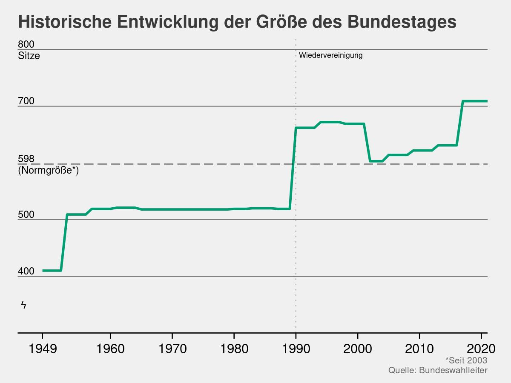
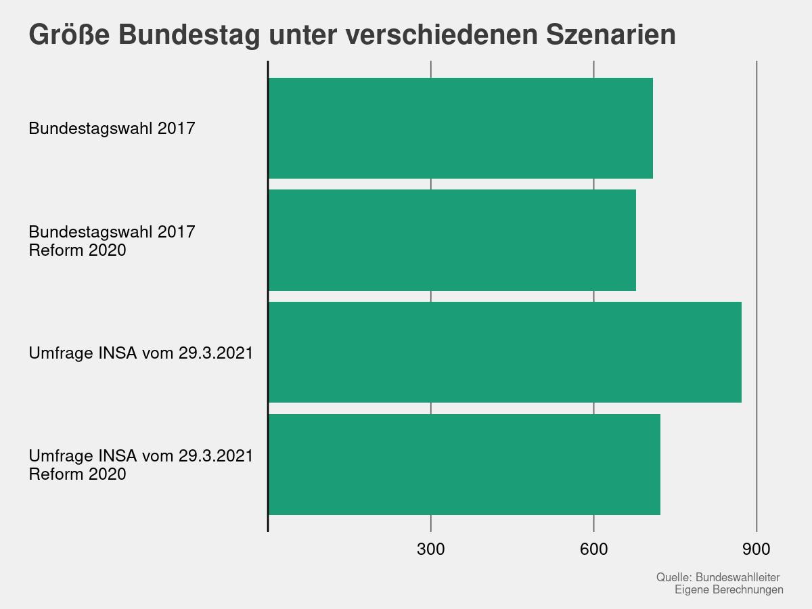

```{r setup, include=FALSE}
knitr::opts_chunk$set(echo = TRUE)
```

# Die Wahlreform und die Überhangsmandate: Wo kommen die her? Wo gehen die hin?

Im September ist Bundestagswahl. Hier kommen erstmals die im Oktober letzten Jahres verabschieden Änderungen zur Anwendung. Dabei wurden die letzten Anpassungen erst vor vier Jahren beschlossen. Der Anlass für die erneute Reform, ist die aktuelle Größe des Bundestages. Anstatt der Normgröße von 598 traten nach der letzten Wahl 2017 709 Abgeordnete ihr Mandat an. Vertraut man den aktuellen Umfragen könnte die Zahl nach der Wahl im September weiter steigen. Laut Eine Reform schien also angebracht, um einen weiteren Anstieg zu verhindern.

Doch ist der Bundestag wirklich zu groß? Um die Frage zu beantworten, lohnt sich zunächst ein Blick ins Ausland. Weltweit ist nur der chinesische Volkskongress mit seinen fast 3000 Mitgliedern größer als der Deutsche Bundestag. Stellt man jedoch die Anzahl der Abgeordneten pro Einwohner gegenüber, repräsentiert ein Parteimitglied in China 450.000 Menschen, während ein deutscher Abgeordneter nur ca. 114.000 Wähler vertritt. Dies entspricht in etwa in den Verhältnissen in den Niederlanden oder in Frankreich. Gleichzeitig vertreten, beispielsweise, die Abgeordneten in der Schweiz oder Belgien jeweils weniger Wähler.

Im internationalen Kontext gesehen, muss man also nicht unbedingt zu dem Schluss kommen, dass der deutsche Bundestag zu groß ist. Der Grund für den Bedarf einer Wahlreform ist historisch begründet. Seit der Einführung des Verhältniswahlrechts 1949 bis in die 90iger hinein bestand der Bundestag aus ungefähr 520 Abgeordneten. Einen Teil des Anstiegs auf die heutige Größe lässt sich mit dem Zusammenschluss von Ost und Westdeutschland erklären. Bei der ersten gesamtdeutschen Wahl 1991(?) erhöhte sich die Anzahl der Abgeordneten von 519 auf 663. Als Reaktion darauf beschloss der Bundestag 1996 eine Reduzierung der Normgröße auf bis heute geltenden 598 Abgeordneten. Dies verringerte die Größe des Bundestags bis zur Bundestagswahl 2017, nach der die Anzahl der Abgeordneten sprunghaft anstieg.



Aber warum sitzen überhaupt so viele Abgeordnete im Bundestag? Dies liegt im deutschen Wahlsystem begründet. Anders als, beispielsweise in den USA oder dem Vereinigtem Königreich, werden einzelne Wahlbezirke direkt von Abgeordneten vertreten. Stattdessen haben Wähler in Deutschland bei der Bundestagswahl zwei Stimmen, die sie abgeben können. Die Erststimme entscheidet, darüber, welcher Abgeordnete den Wahlkreis direkt im Bundestag vertritt (Direktmandat). Die Zweitstimme bestimmt, welche Partei wie viele Abgeordnete in den Bundestag schicken darf (Listenmandat). Laut deutschem Grundgesetz wird für jeden Wahlkreis ein weiterer Kandidat über diese Stimmen entschieden. Bei 298 Wahlkreisen ergibt sich daraus die Normgröße von 598 Abgeordneten.

Nun kann es passieren, dass eine Partei mehr Direktmandate erhält, als ihr nach der Menge der Zweitstimmen zustehen würden. Diese zusätzlichen Mandate sind die sogenannten Überhangmandate. In der Vergangenheit konnte, aufgrund der Berechnung der Überhangmandaten auf Länderebene, eine abgebende Zweitstimme für eine Partei dazu führen, dass diese insgesamt über weniger Sitze im Bundestag verfügte. Trotzdem waren Überhangmandate zu Beginn der Bundesrepublik oftmals kein großes Problem, da nur vier Parteien im Bundestag vertreten waren. Noch 1997 erklärt das Bundesverfassungsgericht diese für verfassungskonform. Mit dem Aufkommen der Grünen, der Linken und der AfD, ist dies nicht länger der Fall. Folglich befand das oberste deutsche Gerichte das damals geltende Wahlrecht, in zwei Urteilen 2008 und 2012, als verfassungswidrig. Als Reaktion darauf, entschlossen sich die Volksvertreter im Februar 2013 für ein neues Wahlrecht. Dieses gleicht Überhangmandaten auf Länderebene proportional zu den Zweitstimmen aus. Etwas vereinfacht gesprochen, bestimmt die Anzahl der Überhangmandate die Größe des Bundestages. Dabei erhöht jedes zusätzliche Direktmandat, welches eine Partei in einem Bundesland erhält, die Wahrscheinlichkeit, dass diese Direktmandate im Endeffekt ein Überhangmandat ist. Da der Großteil der Direktmandate immer noch an SPD, CDU und CSU geht, ergibt sich die heutige Größe.


Doch wie viele Stimmen entscheiden am Ende über die Größe des Bundestages? Dafür muss man verstehen, wie genau die Überhangmandate ausgeglichen werden. Hierfür wird nach dem Wahlgesetz von 2013 ein mehrstufiges System angewandt. Im ersten Schritt werden auf Länderebene die Direktmandate und die zustehenden Sitze entsprechend der Zweitstimmen für die Parteien berechnet. Entstehen bei dieser Berechnung mehr Direktmandate für eine Partei, als ihr nach Zweitstimmen, besitzen mehr Direktrepräsentanten für Wahlkreise einer Partei das Anrecht, diesem im Bundestag zu vertreten als der Partei in diesem Bundesland insgesamt zustehen würde. Da die Wahlkreise ein Anrecht auf direkt Repräsentation haben, dürfen diese Abgeordnete, aber auf jeden Fall in den Bundestag. Die Differenz zwischen Abgeordneten nach Zweitstimme und Direktmandaten bilden die Überhangmandate.

Um diese Überhangmandaten auszugleichen wird im zweiten Schritt die Anzahl der Abgeordneten im Bundestag erhöht, sodass alle Parteien, welche über fünf Prozent der Stimmen erhalten haben, entsprechend ihrer Zweitstimmen vertreten sind. Etwas vereinfacht formuliert bedeutet dies, dass die Anzahl der Mandate für die Partei mit den meisten Überhangmandaten, gleichgesetzt wird, mit ihrer prozentualen Zustimmung nach Zweitstimmen. Daraus ergibt sich eine Umrechnung von Zweitstimmen zu Bundestagsabgeordneten. Die Anzahl der Mandate für die anderen Parteien berechnet sich entsprechend. Durch die Umrechnung wird garantiert, dass jede Partei über die Menge an Sitzen im Bundestag verfügen, die ihnen nach abgegeben Zweitstimmen zustehen. Die sich daraus ergebenen neuen Sitze werden anschließend auf Grundlage der abgegebenen Stimmen für die Parteien in den Bundesländern wieder auf die Landeslisten verteilt. Je mehr Menschen in einem Bundesland also für eine Partei gewählt haben, desto mehr Politiker aus diesem Landesverband werden nach Berlin geschickt.

Für die Bundestagswahl 2017 bedeutet dies, dass die 6,2 Prozent an erhaltenden Zweitstimmen für die CSU zunächst umgerechnet werden, sodass die im Bundestag vertretenen Parteien auf 100 Prozent der Stimmen kommen. Der Grund für die Umrechnung ist die Tatsache, dass ein Teil der angetretenen Parteien, aufgrund der fünf-Prozent-Hürde, nicht im Bundestag vertreten ist und entsprechend keine Sitze erhält. Hieraus ergibt sich eine effektiv prozentuale Verteilung der Sitze auf die CSU von ungefähr 6,5 Prozent. Diese 6,5 Prozent werden, etwas vereinfacht gesagt, anschließend gleichgesetzt mit den 46 Direktmandaten, welche die CSU in Bayern erhalten hat. Daraus ergibt sich eine Umrechnung von ungefähr einem Prozent der Stimmen zu 7,09 Abgeordneten. Anschließend erhalten die übrigen Parteien Abgeordnete zugewiesen, die sie dann auf die Landeslisten entsprechend der in Bundesländern erhalten Stimmen verteilen.

Doch wie viele Stimmen entscheiden im Einzelnen darüber, ob eine Partei ein Überhangmandat erhält oder nicht? Dafür muss man sich den Abstand zwischen den Abgeordneten, welche ein Direktmandat erhalten haben und dem Kandidaten, der am zweitmeisten Stimmen in dem Wahlkreis erhalten hat. Dabei variiert die Größe der einzelnen Wahlkreis. Zwar sollen Wahlkreise möglichst gleich groß sein und geografisch einheitlich bleiben, trotzdem ist es unmöglich, aufgrund der Struktur der einzelnen Landkreise, gleich große Wahlkreise zu bilden. So ist der größte Wahlkreis, *Fürth*, über 255.000 Wahlberechtigte groß, während der kleinste Wahlkreis, *Coburg*, nur knapp unter 160.000 Wahlberechtigte umfasst. Entsprechend ist auch der Abstand zwischen der Erst- und Zweitwahl eines Wahlkreises. Ein durchschnittlicher Wahlkreis ist 206.000 Wahlberechtigte groß und der Abstand zwischen Direktkandiaten und Verfolger beträgt 20.800 im Schnitt Stimmen. Der Abstand beträgt also durchschnittlich etwa 10 Prozent der Stimmen.


Wenn man nun die Wahlkreise zusammen zählt, kann man berechnen, wie viele Stimmen darüber entscheiden, dass der Bundestag so groß ist, wie er ist. Dabei kann man natürlich nicht sagen, welches Direktmandat ein Überhangmandat repräsentiert, da nur die Summe der Direktmandate zu Überhangmandaten führen. Ob dies nun das Mandat für Konstanz oder Freiburg für die CDU in Baden Württemberg ist, ist für die Berechnung für die letztendliche Größe irrelevant. Deswegen werden für die folgende Berechnung die Mandate nach Differenz zwischen Erst- und Zweitwahl sortiert - im Endeffekt also die kleinstmögliche Verschiebung an Stimmen berechnet, die von einer Partei zu einer anderen Partei wechseln müssen, damit dieser Wahlkreis kein Überhangmandat mehr repräsentiert. Etwas konkreter ausgedrückt: Das Mandat in *Freiburg* fiel in der Bundestagswahl 2017 an Michael Bamberger von der CDU. Die Kandidatin der Grünen, Kerstin Andreae, erhielt 4141 Stimmen weniger. Folglich wird für die nachstehende Berechnung angenommen, dass 2071 Stimmen von der CDU an die Grünen hätten gehen müssen, damit dieses Mandat kein Überhangmandat für die CDU ist. Folgt man diesen Annahmen, so kann man die Anzahl, der Stimmen berechnen, die notwendig wären, um den Bundestag auf seine vorgesehene Größe zu bringen. In der Summe sind dies etwa 230.000 Stimmen oder etwas weniger als 0.5 Prozent der insgesamt abgegebenen Erststimmen.


Dem geneigtem Leser fallen zwei Sachen auf: Erstens, dass die Verkleinerung des Bundestages stufenweise passiert. Der Grund hierfür ist, dass das wegfallen eines Überhangmandates nicht zwangsweise die Umrechnung der Stimmen zu Mandaten beeinträchtigt. In der Grafik sind die Überhangmandate nach Größe der Differenz zwischen Erst- und Zweitwahl sortiert. Folglich kann es dazu kommen, dass zwar ein Überhangmandat für die SPD in einem Schritt weg fällt, die CSU aber immer noch prozentual am meisten Überhangmandate besitzt. Dies führt dazu, dass weiterhin die Umrechnung der CSU für die Berechnung der Mandate verwendet wird.

Zweitens fällt auf, dass der Bundestag auch ohne das vorhanden sein von Überhangmandaten nicht die Normgröße von 598 besitzt. Der Grund liegt darin begründet, dass auch die Zweitstimmenmandate auf Länderebene berechnet werden. Das bedeutet, dass, je nach Wahlbeteiligung und der Anzahl von Stimmen auf nicht im Bundestag vertretenen Parteien, die Umrechnung von Stimmen zu Mandaten unterschiedlich ausfällt. Dies führt dazu, dass die einzelnen Parteien insgesamt eine unterschiedliche Umrechnung von Stimmen zu Mandaten haben. Um dies auszugleichen, erhöht sich die Anzahl an Abgeordneten insgesamt. Etwas salopp formuliert: wenn in Bayern nur 50% der Wähler zur Wahl gehen, diese aber die weiterhin zum Großteil CSU wählen, wäre, auch ohne Überhangmandate, der Bundestag sehr groß. Da die Bayrischen Mandate, im Verhältnis, weniger Stimmen erhalten.


Zusammenfassend lässt sich sagen, dass für die Größe des Bundestages entscheidend ist, welche Partei, wo gewählt wird. Sollten weiterhin der Großteil der Direktmandate an die CDU, CSU und SPD gehen, wird der Bundestag auch in Zukunft nicht merklich schrumpfen. Beachtet man die aktuellen Wahlumfragen, nach denen die Grünen bis zu 23 Prozent der Stimmen prognostiziert werden, ist eher davon auszugehen, dass die Größe in Zukunft höher sein wird. In der Tat, berechnet man die Größe des Bundestages auf Grundlage der INSA Umfrage vom 29.3, wäre der Bundestag 846 Sitze groß. Daran ändert auch die beschlossene Änderung des Wahlrechts wenig, nach der alle, bis zu drei, Überhangmandate mit anderen Landeslisten der selben Partei verrechnet werden. Für die gleiche Umfrage wäre der Bundestag immer noch 846 Sitze groß und damit nur 1.28 Prozent kleiner als ohne die Reform. Selbst bei dem gleichen Ergebnis, wie bei der Bundestagswahl 2017, säßen immer noch 686 Abgeordnete im deutschen Parliament.

Die beschlossene Änderung des Wahlgesetzes umschließt weiterhin eine Verringerung der Wahlkreise von 299 auf 280 für die Bundestagswahl 2025. Die genauen Auswirkungen sind dabei schwieriger vorauszusagen. Die Reform wird die Größe des Bundestagstages auf jeden Fall signifikant verringern, da weniger Überhangmandate entstehen können. Wie groß der Effekt allerdings sein wird, hängt, wie bereits die geltenden Änderung des Ausgleich der Überhangmandate von den erhalten Stimmen der einzelnen Parteien ab. Weiterhin, wird die Aufteilung der neuen Wahlkreise auf die Anzahl der Überhang eine beträchtliche Rolle für die genau Anzahl der Reduzierung der Mandate eine beträchtliche Rolle spielen. Wenn aufgrund der neuen Grenzen von Wahlkreisen Direktmandate, welche vorher keine Überhangmandate waren zu Überhangmandaten werden, wird dieses nicht zu einer Reduzierung der Größes des Bundestages beitragen. Das Thema Überhangmandate wird uns also auch in Zukunft erhalten bleiben.

