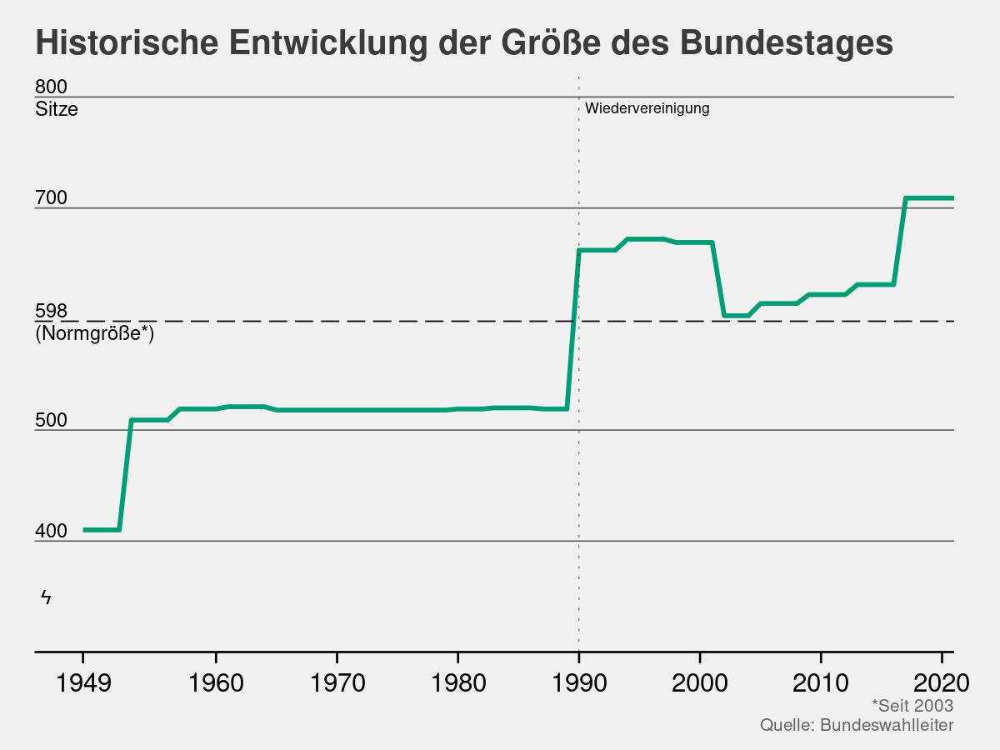
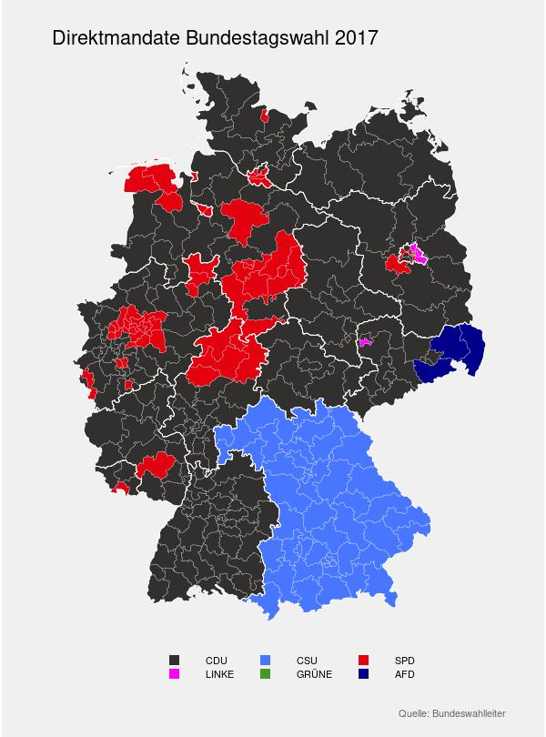
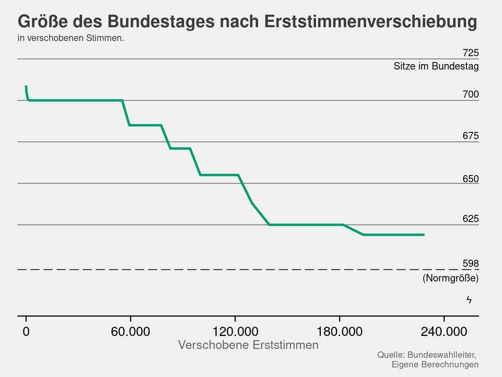
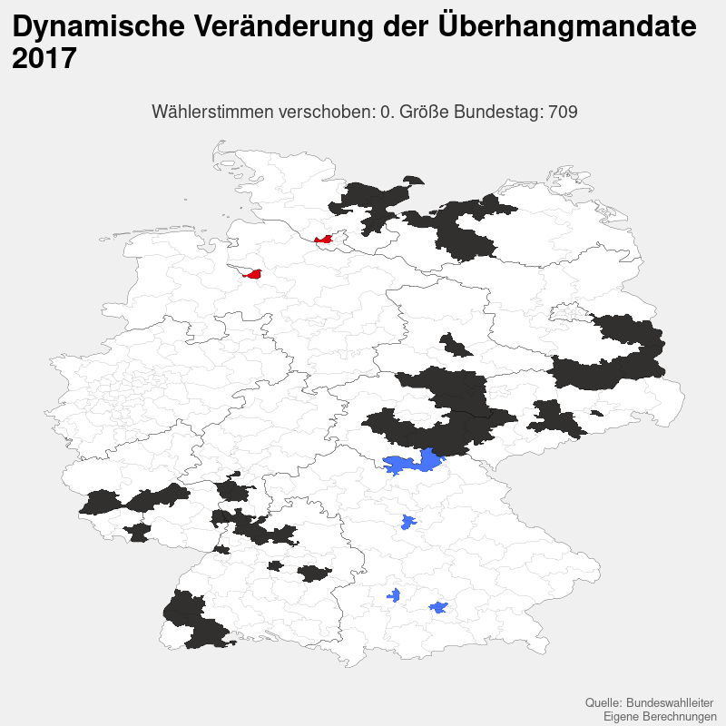

# Die Wahlrechtsreform, der Bundestag und seine Abgeordneten: Und wenn ja, wie viele?

Im September ist Bundestagswahl. Hierbei kommen erstmals die 2020
beschlossenen Änderungen am Wahlgesetz zur Anwendung. Dabei wurden die
letzten Anpassungen erst kurz vor der letzten gesamtdeutschen Wahl 2017
beschlossen. Grund für die erneute Reform ist die aktuelle Größe des
Bundestages von 709 Abgeordneten. Laut Grundgesetz sind nur 598 Sitze
vorgesehen. Eine Reform schien also angebracht. Grund genug die aktuelle
Situation zu betrachten und zu analysieren.

Zunächst einmal stellt sich die Frage: ist der Bundestag wirklich zu
groß? Hierfür lohnt sich ein Blick ins Ausland. Weltweit ist nur der
chinesische Volkskongress größer als der Deutsche Bundestag. In diesem
bestimmen fast 3000 Mitglieder die Politik Chinas. Gleichwohl
repräsentiert dort ein Mitglied des Kongresses 450.000 Menschen, während
ein deutscher Abgeordneter nur ca. 114.000 Wähler vertritt. Das deutsche
Verhältnis von Parlamentariern zu Wähler ist keine Sonderheit. Die
Mitglieder des niederländischen oder französischen Parlaments vertreten
in etwa so viele Wähler wie ihre deutschen Kollegen. In der Schweiz oder
in Belgien vertreten die gewählter Vertreter jeweils weniger Wähler als
in Deutschland.

Im internationalen Kontext gesehen, muss man also nicht unbedingt zum
Schluss kommen, dass der Bundestag zu groß ist. Die Notwendigkeit einer
Wahlreform ist allerdings historisch begründet. Für einen Großteil
seines Bestehens umfasste das westdeutsche Parlament ungefähr 520
Abgeordneten. Nach der ersten gesamtdeutschen Wahl 1990 erhöhte sich die
Größe des Bundestags auf 663 Mitglieder. Als Reaktion darauf beschloss
der Bundestag 1996 eine Reduzierung der Normgröße auf die bis heute
geltenden 598 Sitze. Nach der Bundestagswahl 2017 stieg die Größe
sprunghaft auf 709 Mitglieder an.

Aber warum sitzen überhaupt so viele Abgeordnete im aktuellen Bundestag?
Bei einer Bundestagswahl hat jeder Wähler zwei Stimmen, die er abgeben
kann. Die Erststimme entscheidet darüber, welche(r) Abgeordnete den
Wahlkreis direkt im Bundestag vertritt (Direktmandat). Demgegenüber
bestimmt die Zweitstimme, welche Partei wie viele Abgeordnete in den
Bundestag schicken darf (Listenmandat). Für jeden Wahlkreis ist ein
weiterer Abgeordneter, der über die Liste entschieden wird vorgesehen.
Bei 298 in der Verfassung vorgesehenen Wahlkreisen ergibt sich ein
Parlament mit 598 Abgeordneten.

Nun kann es passieren, dass eine Partei mehr Direktmandate erhält, als
ihr nach Zweitstimmen zustehen würden. Diese zusätzlichen Mandate sind
die sogenannten Überhangmandate. Zu Beginn der Bundesrepublik waren
diese oftmals kein großes Problem. Noch 1997 erklärt das
Bundesverfassungsgericht Überhangmandate für verfassungskonform. Durch
die komplexe Berechnung der Mandate konnte eine zusätzliche Zweitstimme
für eine Partei dazu führen, dass diese über weniger Sitze im Bundestag
verfügte also ohne die Stimme. Zusätzlich nahm das Gewicht der
Überhangmandate mit dem Aufkommen der Grünen und der Linken zu, da die
Zweitstimmen sich auf mehr Parteien verteilten, der Großteil der
Direktmandate jedoch weiterhin an CDU/CSU und SPD ging. Folglich befand
das oberste deutsche Gerichte das damals geltende Wahlrecht in zwei
Urteilen, 2008 und 2012, als verfassungswidrig. Als Reaktion darauf
beschloss der Bundestag im Februar 2013 ein neues Wahlrecht, welches die
Überhangmandate ausgleicht.

Im ersten Schritt werden hierbei auf *Länderebene* die Direktmandate und
die zustehenden Sitze entsprechend der Zweitstimmen für die Parteien
berechnet. Entstehen bei dieser Berechnung mehr Direktmandate für eine
Partei als ihr nach Zweitstimmen zustehen würden, entstehen weiterhin
Überhangmandate. Um diese Überhangmandaten auszugleichen wird im zweiten
Schritt die Anzahl der Abgeordneten im Bundestag erhöht. Dies geschieht
so lange bis alle Parteien, die mindestens fünf Prozent der Stimmen
erhalten haben, entsprechend ihrer Zweitstimmen im Bundestag vertreten
sind.

Um zu dies veranschaulichen: Bei der Bundestagswahl 2017 entfielen 6,2
Prozent der Zweitstimmen auf die CSU. Da einige Stimmen für kleinere
Parteien nicht im Bundestag vertreten sind (wegen der
fünf-Prozent-Hürde), erhöht sich dieser Anteil auf 6.5 Prozent.
Anschließend wird, vereinfacht gesagt, die Anzahl der Mandate für die
Partei mit den prozentual am meisten Überhangmandaten als Grundlage für
die Berechnung der Mandate heran gezogen. Für Bundestagswahl 2017 war
dies die CSU. Entsprechend werden die 6,5 Prozent der CSU gleichgesetzt
werden mit den 46 Mandaten, auf welche die Partei nach Direkt- und
Listenmandaten ein Anrecht besitzt. Hieraus ergibt sich eine Umrechnung
von ungefähr einem Prozent der insgesamt abgegebenen Zweitstimmen zu
7,09 Abgeordneten ≙ 6.8% ~ 7.09/1%). Im Anschluss erhalten auch die
übrigen Parteien 7,09 Abgeordnete für jedes Prozent der Zweitstimmen. So
kommt es zur letztendlichen Größe des Bundestags von 709 Abgeordneten.

Daraus ergibt sich die spannende Frage: wie viele abgegebene Stimmen
überhaupt darüber bestimmen, ob Parteien Überhangmandate erhalten. Dabei
kann es passieren, dass eine Partei für ihren Direktkandidaten eine
Stimme mehr erhält, als der Kandidat mit den zweitmeisten Stimmen. Wenn
man nun alle Wahlkreise zusammen nimmt, kann man berechnen, wie viele
Stimmen darüber entscheiden, dass der Bundestag so groß ist, wie er ist.
Aus dem bereits erwähnten Grund, dass potenziell jedes Direktmandat ein
Überhangmandat für eine Partei repräsentiert, wird für die folgende
Berechnung angenommen, dass die Wahlkreise mit dem geringsten Abstand
zwischen Wahlkreisgewinner und dem mit den zweitmeisten Stimmen
Überhangmandate darstellen. Dadurch wird die kleinstmögliche
Verschiebung an Stimmen berechnet, die von einer Partei zu einer anderen
Partei wechseln müssten, damit in einem Bundesland und damit auch auf
Bundesebene keine Überhangmandate mehr für Parteien anfallen.

Etwas konkreter ausgedrückt: Das Direktmandat für Freiburg fiel bei der
Bundestagswahl 2017 an Michael Bamberger von der CDU. Die Kandidatin der
Grünen, Kerstin Andreae, erhielt 4141 Stimmen weniger. Folglich wird für
die nachstehende Berechnung angenommen, dass 2071 Stimmen von der CDU an
die Grünen hätten gehen müssen, damit dieses Mandat kein Direktmandat
und somit auch kein Überhangmandate für die CDU mehr repräsentiert.
Folgt man diesen Annahmen, so kann man die Anzahl der Stimmen berechnen,
die die Größe des Bundestags bestimmen. In der Summe sind dies etwa
240.000 von ca. 45 Millionen oder 0.5 Prozent abgegebenen Stimmen.
Anschließend sitzen anstatt 46 aus 298 Wahlkreisen keine mehr
Überhangmandate im Bundestag.

Wie man an folgender Grafik erkennen kann, würde eine Verschiebung der
Erstimmen bezüglich der Überhangmandate eine deutliche Verkleinerung des
Bundestags bedeuten. Beispielsweise würde eine Verschiebung von 160.000
Erststimmen eine Reduzierung auf 625 Sitze bedeuten. Dabei ändert sich
nicht das Verhältnis der Parteien im Bundestag. Allerdings ändern sich
die Direktrepräsentanten für manche Wahlkreise. So würde für Freiburg
nun Kerstin Andreae von den Grünen im Bundestag sitzen.

 In der Grafik fallen zwei Sachen
ins Auge. Zum einen, dass der Bundestag auch ohne Überhangmandate nicht
die Normgröße von 598 besitzt. Dies liegt daran, dass neben den
Überhangmandaten auch die Zweitstimmenmandate auf Länderebene berechnet
werden. Je nach Wahlbeteiligung und der Anzahl von Stimmen auf nicht im
Bundestag vertretenen Parteien, kann die Umrechnung von Stimmen zu
Mandaten für die Parteien unterschiedlich ausfallen. Um diese
auszugleichen, erhöht sich die Anzahl an Abgeordneten insgesamt. Etwas
salopp formuliert bedeutet dies, dass wenn in Bayern nur 50% der Wähler
zur Wahl gingen, diese aber die weiterhin zum Großteil mit der
Zweitstimme CSU wählten, der Bundestag auch ohne Überhangmandate für die
Partei sehr groß wäre, da die Bayrischen Mandate im Verhältnis, weniger
Stimmen repräsentierten.

Zum Anderen fällt auf, dass die Verkleinerung des Bundestages
stufenweise passiert. Der Grund hierfür ist, dass das wegfallen eines
Überhangmandates nicht zwangsweise die Umrechnung der Stimmen zu
Mandaten beeinträchtigt. Für die Berechnung sind die Überhangmandate
nach Abstand zwischen den Kandidaten sortiert. Dadurch kann es dazu
kommen, dass zwar ein Überhangmandat für die SPD in einem Schritt weg
fällt, die CSU aber immer noch prozentual am meisten Überhangmandate
besitzt. Deswegen wird weiterhin die Umrechnung von Stimmen zu Sitzen
der CSU verwendet wird und die Größe des Bundestages bleibt unverändert.

Und zumindest ein Teil der Wähler der CSU könnten, vertraut man den
Umfragen, von den Unionsparteien und der SPD zu anderen Parteien
wechseln. Wäre die letzten Tage Bundestagswahl gewesen, hätten beide
Parteienfamilien jeweils etwa fünf Prozent im Vergleich zur
Bundestagswahl verloren. Gleichzeitig würden etwa 22 statt 9 Prozent an
die Grünen gehe. Sollten diese gleichzeitig zusätzlichen Direktmandate
gewinnen, müssten die Überhangmandate der drei Regierungsparteien weiter
ausgeglichen werden und die Größe des Bundestages weiter steigen. In der
Tat, legt man die INSA Umfrage vom 29.3 zu Grunde und geht davon aus,
dass sich an den Direktmandaten nichts ändert und sich die Veränderungen
anteilig über alle Bundesländer verteilen, wäre der Bundestag in etwa
872 Sitze groß. Um ein weiteres Anwachsen des Bundestages zu verhindern,
beschloss der Bundestag im Oktober letzten Jahres eine Reform des
Wahlrechts. Danach werden bis zu drei Überhangmandate mit anderen
Landeslisten der selben Partei verrechnet werden. Die 11 Überhangmandate
in Baden-Württemberg für CDU würden also mit den Listenmandaten in
beispielsweise Nordrhein-Westfalen oder Niedersachsen verrechnet werden.
Für die gleiche Umfrage wäre der Bundestag so 723 Sitze groß und damit
etwa 17 Prozent kleiner als ohne die Reform. Wäre die Reform schon bei
der Bundestagswahl 2017 zur Anwendung gekommen, würde der Bundestag
heute 678 Abgeordnete umfassen.

Zusammenfassend lässt sich sagen, dass für die Größe des Bundestages
entscheidend ist, welche Partei, wo gewählt wird. Sollten weiterhin der
Großteil der Direktmandate an die CDU, CSU und SPD gehen, wird der
Bundestag auch in Zukunft nicht merklich schrumpfen. Die beschlossene
Änderung des Wahlgesetzes umschließt weiterhin eine Verringerung der
Wahlkreise von 299 auf 280 für die Bundestagswahl 2025. Die genauen
Auswirkungen sind dabei schwieriger vorauszusagen. Die Reform wird die
Größe des Bundestages auf jeden Fall signifikant verringern, da weniger
Überhangmandate entstehen können. Wie groß der Effekt allerdings sein
wird von den erhalten Stimmen der einzelnen Parteien ab. Weiterhin, wird
die Aufteilung der neuen Wahlkreise auf die Anzahl der Überhang eine
beträchtliche Rolle für die genau Anzahl der Reduzierung der Mandate
eine beträchtliche Rolle spielen. Wenn aufgrund der neuen Grenzen von
Wahlkreisen Direktmandate, welche vorher keine Überhangmandate waren zu
Überhangmandaten werden, wird dieses nicht zu einer Reduzierung der
Größe des Bundestages beitragen. Das Thema Überhangmandate wird uns also
auch in Zukunft erhalten bleiben.

